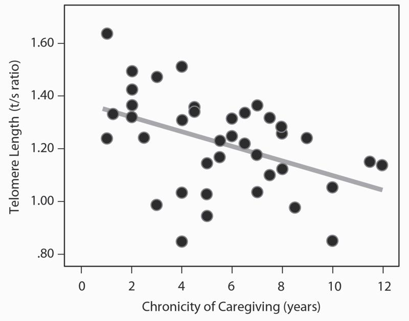
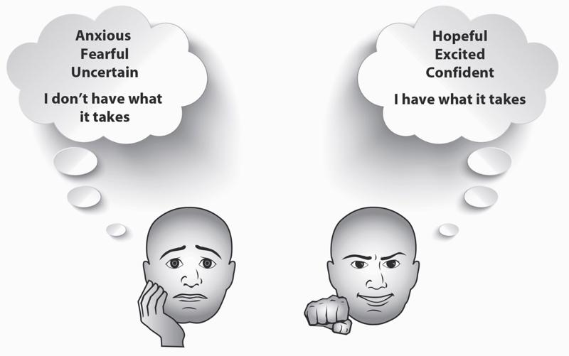

# 1902. 端粒效应2：压力的一念之间
> 万维钢·精英日课第一季
2017-07-12

今天咱们继续说布莱克本和埃佩尔的《端粒效应》。咱们先来想象一个场景。假设你在某个公司工作，平时就很忙，经常加班，你感到有点劳累，但还能应付过来。现在经济形势不太好，你一方面希望能更进一步，另一方面也有点担心被裁员。有一天，老板突然宣布，明天要搞一个员工能力考核，考得好的升职加薪，考得差的就要被裁。请问你此时，会是什么样的心情？现在科学家有足够的证据表明，你面对像这样的局面时候的心态，决定了你变老速度的快慢。 

## 2.1 压力的因果

上次我们说到，人类衰老的机制在于染色体的端粒变短。每个人的端粒变短速度快慢不一，而两位作者的一个重要发现，就是压力会加速端粒变短。下面这张图是研究者对那些长期照顾生病孩子的妈妈们的端粒测量结果。总体趋势是清楚的：一个妈妈照顾孩子的年头越长，她的端粒就越短。 

（横坐标是照顾了多少年，纵坐标是端粒长短）

这个局面你想想都难受。一对夫妇高高兴兴地生了个小孩，结果孩子有先天性的生理疾病，从小就需要特殊照顾，长大了生活也不能自理。他们义无反顾地决定把孩子养大。妈妈辞职在家照顾孩子。这是个没有下班时间、没有休息日，甚至可以说是没有希望的工作。

孩子 24 小时随时都可能需要她，没完没了地打针吃药，没完没了地约见医生、讨论病情、换医院、做各种决定，还要想办法给孩子一个尽可能完整的人生。即便把这些妈妈的年龄、自身肥胖程度这些因素都排除掉，这个趋势也非常明显：照顾孩子的时间越长，妈妈的端粒就越短。

科学家看到这样的相关性关系，总要问一问到底能不能确定因果性：是压力导致了端粒短，还是端粒短的人更容易感受压力？而这张图说的是承受压力的时间和端粒的关系，因果是确定的 —— 一个母亲的端粒长度总不可能决定她孩子的患病时间长短，所以一定是压力时间决定了端粒长度。

研究者采访这些妈妈，她们说压力的感受就好像胸口有一块巨石、胃打了个结、肺部有个什么东西挡着无法呼吸、身边随时有人要攻击她一样。这已经不仅仅是心理压力了，这是明显的生理反应。 

## 2.2 威胁和挑战

虽然总体上都受到了压力的影响，但是这些妈妈们的反应并不完全一样。有些妈妈照顾孩子的时间很长，但端粒变短的情况还不算太严重。这是怎么回事呢？两位作者说， 关键不在于压力本身，而在于你对压力的感受。端粒变短，并不是对压力的反应 —— 而是对「你对压力的反应」的反应。各种研究，包括在实验室里直接对受试者进行压力测试的结果表明，人对压力有两种不同的反应。

第一种反应叫「威胁」。如果你走在丛林之中，手无寸铁，突然跳出来一只老虎要吃你，你感到非常害怕，你的反应就是对威胁的反应。你的血管会收缩，你的血流量会减少。你的肾上腺会释放皮质醇，给你带来更多的葡萄糖。你的心率加快、血压升高。你的迷走神经的活动会下降，这使得你的表情变僵硬。你可能会感到无法移动，你的手脚冰冷，你甚至想释放一下膀胱。

昨天我们说到压力会导致加速变老，咱们专栏的读者「我若为王」就问，既然压力这么不好，为什么感受压力的基因还都流传下来了？—— 这就是为什么：你这种压力反应，是在做好被吃的准备。这些生理变化，会让你在被动物咬一口的情况下，流的血少一点，疼痛感小一点。如果你侥幸活下来，你受的伤就不至于太严重。

而正是这些生理反应，让你的端粒变短。具体是通过什么样的机制让端粒变短的，跟端粒酶有没有关系，书里没有讲，我想现在科学家应该还不知道。统计学的证据是，实验室里越是容易产生这种「威胁」反应的人，端粒就越短。威胁反应还包括焦虑感和羞耻感。甚至事情还没发生，仅仅是想到要面对这样的压力，人就会有这些反应。

第二种反应叫「挑战」。同样是面对一只老虎，如果你不但不害怕，还把这当做一个成为打虎英雄扬名立万的机会，你的生理反应就会不一样。你的心率还是会增加，你的肾上腺还是会释放皮质醇，可是你的血管没有收缩，你的血液中含氧量提高了，你现在有更多血液流向大脑和四肢，你把全身的资源都调动起来，准备战斗。你感到很兴奋。

这也是那些最成功的运动员面对重大比赛时候的感觉。他们把威胁变成挑战，把压力变成动力。如果你能保持这样的心态，你的端粒就会很长。面对压力人的端粒变短速度，取决于你的「威胁」感和「挑战」感各占多少比例。 

那这两种反应又是从哪来的呢？也许第二种人本来就身体好、实力强大，所以才敢于迎接挑战！但是布莱克本和埃佩尔说，你在任何情况下，都是有选择的。

## 2.3 一念之间

我以前听说过一个研究。某著名大学，大概是普林斯顿，用刚入学的新生做了一次实验。实验是给新生组织了一次考试，学生被随机分成两组。「威胁组」的学生被告知，这个考试是看看你们到底够不够资格上普林斯顿；而「挑战组」的学生们则被告知这次考试的试题很难，是为了看看他们到底能优秀到什么程度。结果是挑战组的成绩大大好于威胁组。《端粒效应》说，这种研究还有人做过很多。仅仅是一个心态的不同，仅仅是你怎么看这个事件，就决定了你的表现。

我以前听说这些研究就觉得这也太玄了 —— 但是你考虑到血液流量都变了这种生理反应，这些结果似乎是可以理解的。人的感情不是平白无故冒出来的。一个人如果从小被父母虐待、被同学欺负，那可能就养成了胆小怕事的思维习惯，面对压力就更容易触发「威胁」反应。但既然实验者一句话就能把受试的学生影响到不同的心态上去，也许每个人都可以主动改变心态。

书中举了个运动员的例子。有个美国女短跑运动员一到大赛就紧张，各种生理反应，她就找到一位专门辅导职业选手的运动心理治疗师，说我能不能不要这个压力。治疗师说你不能不要压力啊！有压力你的心跳才能变快，你的血液流量才能增加，你才能更好地发挥啊。你要做的是把威胁变成挑战 —— 下次感受到压力，你要对自己说这很好，我有压力了，我正好利用这个压力带来的生理反应投入比赛。结果她成绩果然提高了。

所以关键就在于你对压力的反应是威胁还是挑战。再想想咱们一开头说的那个公司的考核，你的正确态度是把这当成一个升职加薪的好机会。也许你实力不行挑战失败，但至少你的端粒没受损失。这招对长期照顾患病孩子的妈妈们也有用。生活不会永远都处在压力状态，总会有些间隙，人总有自由决定自己怎么想。

但不幸的是，在实验室里，的确是这些妈妈们更容易触发威胁反应。短期、间隔的压力能锻炼人的抗压水平，但人需要休息。放松、冥想之类的方法可以减压。人不能一直都是兴奋的挑战姿态，感到威胁也是本能。调整心态这个方法很有用，但长期不断的压力，也许还是会让人端粒加速变短。

不但是端粒，长期的压力感还会破坏人的免疫系统，还会让人更容易得上什么炎症。压力感，是健康的大敌。书中提供了几个实践证明有效的消除压力感的方法。 

## 2.4 减压方法

人生最严重的一种威胁是身份认同威胁。比如一个人没有通过什么考试，或者被公司裁员了，他就可能会质疑自己的身份认同。本来我认为我是个优秀的人，现在我是不是不行了？我还有价值吗？我何以自处呢？

这时候你一定要冷静。要知道人生是复杂的，你的身份有多个维度。你不但是个员工，你还是妻子或者丈夫，父母或者子女，是朋友，是社区的重要成员，是个好公民。你的价值体现在所有这些维度上，就算其中一方面暂时出了问题，你还是社会中流砥柱和国家栋梁。说白了，就是你要想得「宽」一点。

另一个办法则是想得「远」一点。比如你可以用一个第三人称的视角看自己，甚至你可以用第三人称来称呼自己。研究表明如果你在心里对自己直呼其名，而不说「我」，你的威胁感、焦虑感和羞耻感就会降低。你还可以假想一个自己是在参演人生的电视剧，而另一个自己正在从远处观看。从远处看，你遇到的这些困难可能不算什么。你还可以像我们在《成大事者怎么才能不纠结》这期专栏里说过的那样，想想十年之后这件事又算得了什么。 

## 由此得到

导致端粒缩短和健康恶化的并不是压力本身，而是压力感。把压力视为威胁还是视为挑战，这心态上的一念之差就会带来很不一样的、实实在在的生理反应。事情还是这个事情，仅仅是你面对它的态度不一样，结局就很不一样。人体这台机器还真是奇妙。我们专栏这段时间讲的一个主题就是思想不但能指导行动，而且能带来生理反应，进而左右大脑和身体的硬件设备。影响端粒的思想还不只是压力感。咱们下次再说。 

本期推荐阅读：

日课178｜《决断》解读3：成大事者怎么才能不纠结

