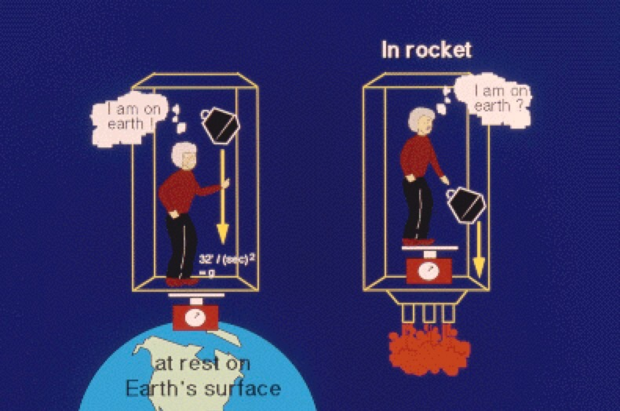
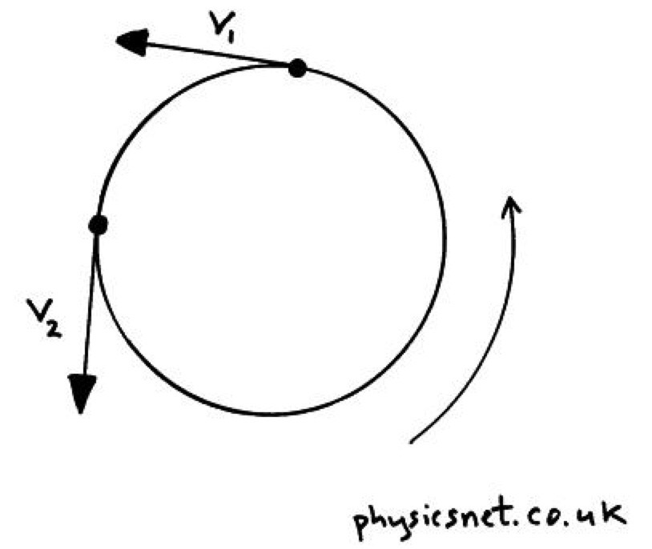
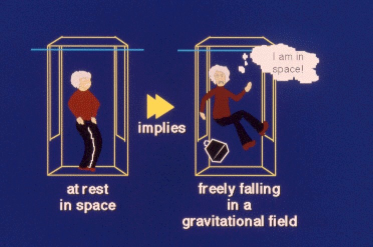

# 0108. 相对论8：不可思议的巧合

万维钢·精英日课³

2018-12-03

不知道你亲眼见过鲸鱼没有。我在海洋世界看过鲸鱼的表演。有的动物可爱，有的动物凶猛，而鲸鱼给我的感觉跟别的动物完全不一样。鲸鱼的身体那么大，曲线那么美，姿态又是那么优雅。鲸鱼游来游去，有时候还活泼地向观众拍打水花。可是我坐在那里，感觉它们好像是比人类更高级的存在，有如神明一般。

广义相对论给我的感觉就是这样。大，而且优雅。

广义相对论是一个美丽的理论。

牛顿的引力公式过于直白，没有内涵。我们应该庆幸自己生活在一个广义相对论主导的宇宙里。广义相对论的数学特别难，思想却是简单的，只是非常深刻。想想它的来龙去脉，它意味着什么，它能推演出什么东西，其乐无穷。

咱们还是先来一点铺垫。讲狭义相对论的时候我们已经看到，爱因斯坦喜欢给你设定一两条最简单的原理，然后不管推导出来什么怪异的结论你都得接受。广义相对论也是这样。

## 8.1 广义·相对性原理

狭义相对论的缘起是一个危机。物理学家搞不清楚光速到底是相对于谁的。一个问题等了 18 年，等爱因斯坦长大了，才给解决。但是广义相对论可不是这么来的。广义相对论，是爱因斯坦自己提出来要干的事儿。

1905 年，刚刚发表了狭义相对论，爱因斯坦就已经开始思考广义相对论，用了十年才最终完成。那他想要的是什么呢？

我们知道狭义相对论的出发点是「相对性原理」：一切匀速直线运动或者静止的坐标系下，物理定律都是一样的。

现在爱因斯坦想的就是，为什么非得限制成「匀速直线运动」呢？为什么「加速」运动就不行呢？物理学中的速度不但有大小而且有方向，所谓「加速运动」，就包括了像圆周运动、拐弯、变速等等各种运动。有了一个加速度，就可以描写所有「瞬时的运动」了。

所以爱因斯坦说，我能不能把相对性原理再推广一下，改成 —— 在所有的坐标系下，物理定律都是一样的。

这就叫「广义的相对性原理」。这个思路很有哲学味道，但是它蕴含着颠覆性的新物理学。

当时并没有人给爱因斯坦提这个需求，那时候别的物理学家都还在消化狭义相对论。

但是，我想你容易理解爱因斯坦这个思路。这就好比说我已经统一了中国，那我下一步是不是应该征服全世界呢？其实，当时世界人民并没有表现出想被你征服的强烈愿望，是爱因斯坦自己非得这么干。

为此，爱因斯坦必须弄清楚「引力」。

## 8.2 加速和有引力

让爱因斯坦取得突破的首先是这么一个思想实验。想象你站在一个像电梯一样的长方形的封闭飞船里。在你脚下有个火箭，给你提供一个推力，让你一直向上加速运动。

你可以想象这种运动跟匀速直线运动截然不同。在匀速直线运动里你是自由的，但是加速运动里你会感到一个力。我们坐车的时候都有过这种感觉，车一加速，你会有一个推背感。

那么爱因斯坦就问，我在飞船上做加速运动的时候，感受到火箭的推力，这种感觉，和我站在地面感受到地球的引力，有什么区别吗？

地球引力给我们的感觉是实实在在的。你站立的时间长了会觉得累，就算躺在床上，后背也会有一个压力。可是在飞船上也是这样，加速会给你一个推力的感觉。

在地面，如果我让一个小球自然下落，它在引力作用下会越落越快，加速冲向地面。可是我在火箭里也是这样 —— 我放开小球，小球就自由了，但是火箭在往上走，火箭的地板会加速冲向小球：在我看来，这完全等同于小球加速冲向地面。

一个是加速向上的火箭里，一个是站在地面静止。牛顿会认为这完全是两回事，运动状态不一样，受力情况也不一样，前者你只受到火箭的推力，后者你同时受到地球的引力和地面的推力。

但是爱因斯坦说，我在飞船内部做实验，明明观测不到任何区别。

## 8.3 自由落体和没有引力

我们再看一个思想实验。爱因斯坦想的原始版本是，想象你在一个电梯里，电梯突然间失控，以自由落体的形式往下坠落，你想想那是一个什么感觉。

答案是你会感到「失重」。当然电梯这个想象有点不吉利，咱们换一个对现代人来说更直观的场景。太空的空间站，绕着地球在做圆周运动，其实跟坠落的电梯一样，都是自由落体。只不过空间站有个很高的水平速度，它不会真的掉下来。

自由落体运动中的物体处在失重状态。我们看宇航员就是失重的，他们可以在空间站里漂浮，他们不分上和下。他们如果把水滴放在空中，水滴不但不会下落，而且还呈现一个完美的球形。

这给了很多观众一个误解，以为是太空没有引力。其实空间站的高度跟地球半径相比不算什么，太空的引力并不比地面低多少。你在太空之所以感觉不到引力，是因为你是在做自由落体运动！

宇航员绕着地球转也好，电梯从高层掉落也好，它们都是自由落体，都会失重，也都是「加速运动」。别忘了，速度不但有大小，而且有方向。圆周运动的速度大小可以不变，但是方向一直在变，它跟匀速直线运动有本质的区别。所以，圆周运动也是一种加速运动。

好，那爱因斯坦问，这种运动中的失重感，跟我在一个远离一切星球、做一个完全不受外力影响的匀速直线运动，有什么区别吗？

牛顿会说当然有区别！前者是引力作用下的加速运动，后者是没有外力时的匀速直线运动！

但是爱因斯坦说，我身处那样的环境，不管做什么实验，都无法发现两者的区别。

这就很有意思了。之所以没区别，这里边蕴含着一个你想不到，但是在物理学家看来是极其怪异的事实。

## 8.4 巧合

咱们先想想这个问题：为什么自由落体明明是个加速运动，可是爱因斯坦却说它跟匀速直线运动没区别呢？因为自由落体状态下所有物体的加速度都是一样的。

我们高中学过，地球上任何一个物体，无论是苹果，桌子，还是一个胖子，他们如果从高空掉下来，所有物体的加速度都是一样的，你可能还记得那个数字，加速度都是 9.8m/s²。

只有这样，当你在空间站中把一个小球悬浮在空中的时候，它才会一直停留在你身边，它会跟着你一起动。如果小球和你的加速度不一样，你们两个就会迅速分开，你就会觉察到现在不是匀速直线运动，对吧？

好，那为什么自由落体中所有物体的加速度都一样呢？因为地球引力对所有物体一视同仁。

那为啥会一视同仁呢？你以前学高中物理的时候是先默认了一视同仁，现在我换个讲法你就发现其中的问题了。

牛顿力学告诉我们，一个物体受到力，是导致它产生加速度的原因，力 = 质量 × 加速度。受力带来的加速度大小跟这个物体的质量有关系，对吧？这个质量，我们先称之为「惯性质量」。

牛顿引力公式又告诉我们，每个物体感受到的地球引力的大小，也跟这个物体自身的质量成正比，对吧？这里又有一个质量，这个质量，我们先称之为「引力质量」。

中学老师一上来就告诉你「质量、质量」 —— 可是你想过没有，这两个地方出现的质量，为什么是一样的呢？换句话说，为什么「惯性质量」非得等于「引力质量」呢？

这是一个完全合法的疑问。惯性质量决定了力怎么给物体带来加速度 —— 任何形式的力都可以，电磁力带来加速度也是用这个质量算，这里面跟「引力」并没有天生的关系。引力质量仅仅是引力的一个性质，决定了一个物体受到的引力大小，也就是「重量」。

我们小时候总是默认质量就是重量，越重的东西就越不容易推动，其实它们是两回事。你想想，比如这里有一个胖子，他的「重量」是个向下的东西；而你要推他容不容易推动，那是一个水平方向上的故事。加速度可以是任何力在任何方向的结果，引力可是只有一个方向，那这两者为什么一样呢？

说到这里，有一个相当经典的案例，就是传说中的比萨斜塔实验，伽利略证明了一轻一重两个铁球从高处落下来是同时着地 —— 也就是说，引力给它们的加速度完全一样：引力，很尊重小球的「惯性质量」。

伽利略当年论证为什么两个铁球必须同时着地，用了一个反证法。他说如果是越重的物体落得越快，那我们可以把一个轻的铁球和一个重的铁球粘在一起 —— 一方面，轻的铁球应该拖慢重的铁球，现在的下落速度应该比重的铁球更慢一些；可是另一方面，现在你得到了一个更重的大铁球啊，应该下落更快才对啊？这个矛盾表明，铁球的下落速度应该跟轻重无关。

伽利略这个论证其实站不住脚。伽利略默认了引力给加速度的时候「只看」重量 —— 或者说，引力给重量的时候「只看」它们的加速性能。可是引力凭什么这么干？

惯性质量正好等于引力质量这件事，现代物理学家能给的最好解释，是……纯属巧合。物理学家在真空中精确测量过两个铁球是不是同时落地，在月球上都做过这个实验，结果都是惯性质量精确地等于引力质量。我们不知道为什么这个世界是这样的，但是它就是这样的。

你马上就能想到，这跟「光速不变」好像很像：你再想不通，也得接受。

## 8.5 爱因斯坦的断言

广义相对论的出发点，是爱因斯坦的一个断言 ——

在任何局部实验中，引力和加速运动无法区分。

这句话叫做「等效原理」，它等于就是说「惯性质量 = 引力质量」。爱因斯坦说别问为什么了，这个世界就是这样的。

在一个封闭的房间里，你说你正在地面待着享受引力，我可以说你其实是在一个加速运动的火箭里。你说你正在引力的作用下享受自由落体，我可以说你其实是处在一个不受任何引力影响的匀速直线运动中。

爱因斯坦说，只要这个房间的尺度不是超级大，你说的和我说的就没区别。

那我们再想想，引力到底是个什么东西。站在地面上，你能切切实实感到引力的存在。可是只要你随便做个自由落体运动，引力对你就不存在。

一个东西如果是真实的存在，它怎么可能在静止坐标系下看就有，在一个加速坐标系下看就没有了呢？爱因斯坦的新要求可是物理定律不管在什么坐标系下都一样。

我们的结论就只能是，引力这个东西，其实是个幻觉。

……或者说的严格一点。在局部，引力根本就不存在。在大尺度范围，引力根本就不是力……正如鲸鱼不是鱼。

那引力到底是什么呢？只有爱因斯坦能提出这样的问题，也只有爱因斯坦能回答这个问题。咱们下一讲再说。