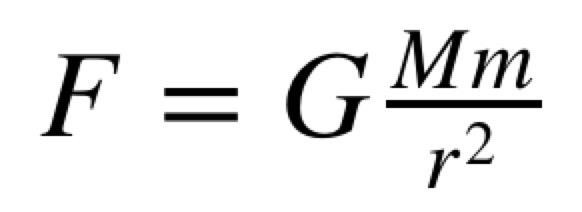
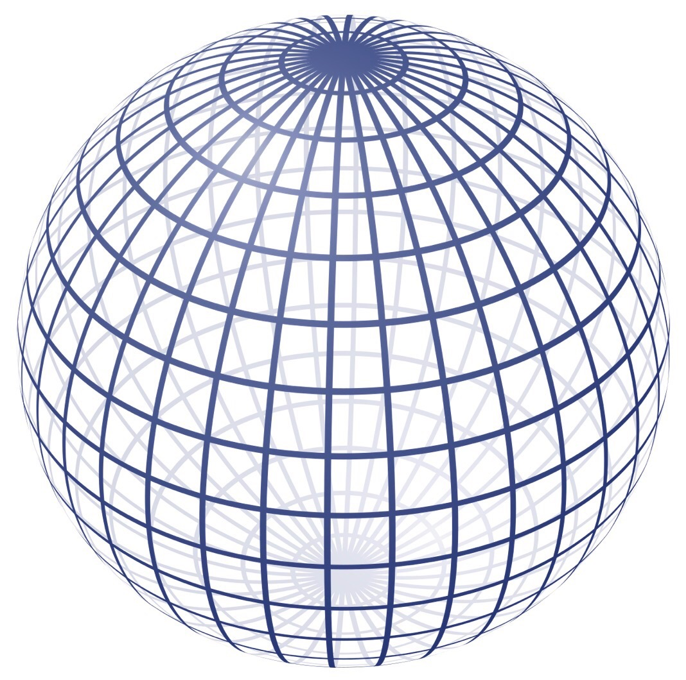
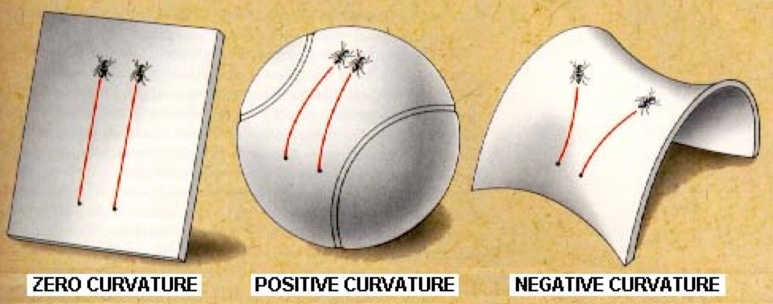
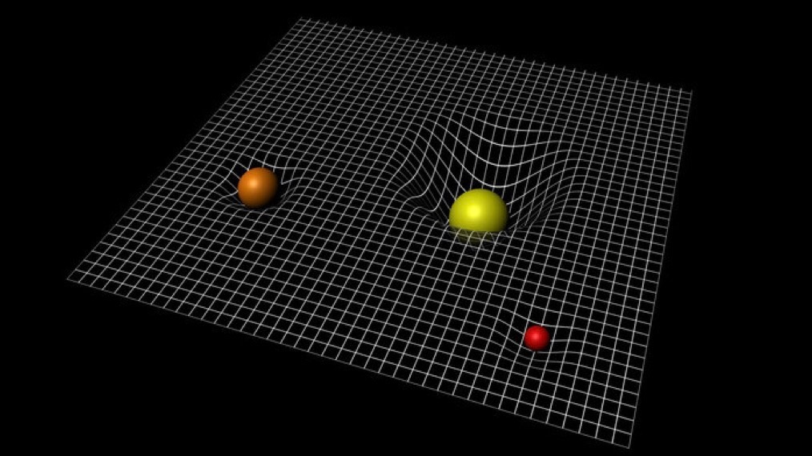
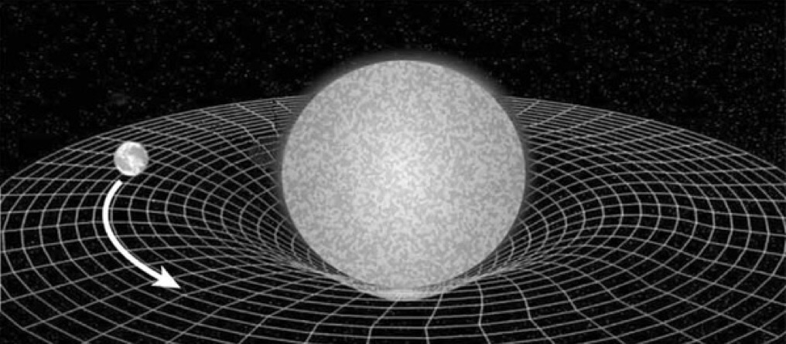
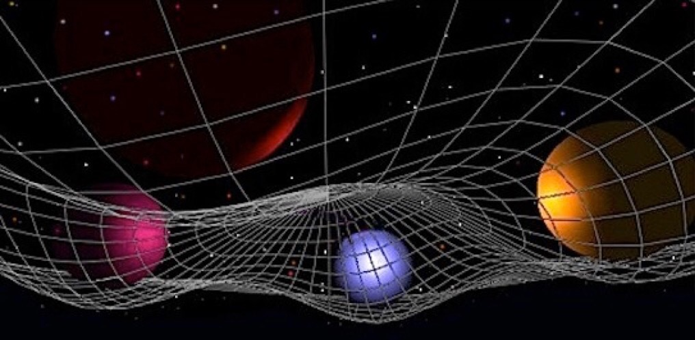

# 0109. 相对论9：大尺度的美

万维钢·精英日课³

2018-12-04

广义相对论的数学非常难。连爱因斯坦都觉得自己的数学不够用，后来是在数学家的帮助下使用微分几何的知识，才得到最终的引力场方程。我们不会讲任何数学细节，但是既然说到了广义相对论，我想你应该看一眼引力场方程的样子——

然后你可以把它跟中学学过的牛顿引力公式做个对比 —— 

我给你打个直观的比方。牛顿引力公式就好像是一个完美的球体。而广义相对论，就好像是一头美丽的鲸鱼。

你不见得非得知道鲸鱼身上每一处结构的精确尺寸，你没必要学会怎么画鲸鱼，但是你可以欣赏鲸鱼的美。

为了理解广义相对论，我们先说一点无比简单、但是不会在高考中出现的几何学。

## 9.1 弯曲的几何

这个关键概念是时空可以是弯曲的。什么叫「时空」的弯曲呢？不用数学语言很难精确描述，但是我们可以做个类比。

一张放在桌子上很平很平的纸，可以代表一个二维平面。只要它足够平，我们在初中学的平面几何知识就都好使。我们清楚地知道什么叫直线。两条平行线永远都不会相交，三角形内角之和等于 180 度。

好，那现在给你一个地球仪，请问这个地球仪的表面，是二维的，还是三维的呢？

你直观的感觉它可能是三维的，因为只有三维空间里才有地球仪……但是数学家可不这么看。我们考虑的仅仅是地球仪的表面。一只蚂蚁在上面爬，它永远也不能离开这个表面。蚂蚁只需要一个经度、一个纬度，两个数字就能描写地球仪上的位置 — 所以球的表面，其实是一个二维的平面。

它只是不那么「平」而已。它是一个弯曲的平面。

我们生活的这个世界的空间是三维的，如果你把时间也算成一维，那就总共是四维时空。广义相对论并不要求有什么更高的维度，广义相对论只是说，这个四维时空，可以是弯曲的。你可能听说过「超弦理论」，说总共有多达 11 维，其实那些多出来的维都是蜷缩着的，不能算数。

有些科幻小说作家认为四维时空不过瘾，非得给宇宙增加几维，还要搞「降维打击」，那些没什么意思。物理学家早就知道，如果空间大于三维，其中行星绕着恒星公转的轨道就会是不稳定的，也就无法演化出智慧生物来。

怎么理解四维时空的弯曲呢？我们这里只能用弯曲的二维平面做一个类比，但是请记住，弯曲的不仅仅是空间，也包括时间。

哪怕是弯曲的平面上，数学家也可以谈论「直线」 —— 当然没有完全直的直线，但是可以有「最直的线」。比如地球表面是个球面，你从北京去纽约，虽然你不可能弄个地底下的隧道走绝对的直线去，但是仍然存在一条球面上的最短的线路 —— 肯定不是拐来拐去那种。

对球面来说，两点之间最短的线路是走「大圆」，也就是圆心正好是球心的那个圆。比如下面图中两点之间最直的线，就是大圆的一段。

[图片来自维基百科]

哪怕不是球面，各种复杂曲面上，也都有这种「最直的线」，当然就不一定是大圆了，我们统一称之为「测地线」。

[图片来自 starchild.gsfc.nasa.gov]

数学家黎曼 —— 就是提出「黎曼猜想」的那个黎曼 —— 早在 1854 年就已经把复杂曲面的这些数学研究出来了，我们现在称之为「黎曼几何」。黎曼几何是弯曲空间中的几何学，也是广义相对论的数学基础！在黎曼几何里，两条「平行」的测地线可以相交也可以越分越远，三角形的内角之和可以大于也可以小于 180 度，你看多了就习惯了。

这些基本上就是你理解广义相对论所需要的数学。

## 9.2 广义相对论 ABC

广义相对论，简单地说就是两句话。

第一，一个有质量的物质，会弯曲它周围的时空。这叫「物质告诉时空如何弯曲」。

第二，在不受外力的情况下，一个物体总是沿着时空中的测地线运动。这叫「时空告诉物质如何运动」。

完了。

这里边根本没有引力的事儿，根本不需要引力。

这个画面是这样的。你把时空想象成一个二维的蹦床。本来蹦床是平的，你往上面放几个球，蹦床上有球的地方周围就变成弯曲的了 —— 这几个球，弯曲了各自周围的时空。

[图片来自www.esa.int]

地球为什么绕着太阳转？牛顿认为那是因为太阳对地球有个引力。但是广义相对论说，地球根本不知道太阳在哪里，只是因为太阳把时空弯曲得比较厉害，地球是根据自己所在时空的测地线运动而已。就好像蹦床上的小球可以绕着大球滚动，而你知道大球并没有吸引小球，那只是因为蹦床上大球的周围有个凹陷！

[图片来自 www.uh.edu]

同样的时空，每个物体的速度不一样，它看到的和遵循的测地线也不一样。有的物体会直接掉向太阳，有的会绕着太阳做椭圆运动，有的擦肩而过，这些都只不过是在沿着自己的测地线运动而已。

[图片来自 billadamsphd.net]

当然，每个有质量的物体在弯曲时空中运动的同时，也在弯曲着自己周围的时空，只是弯曲的程度不同。时空的形状由所有这些物质共同决定，然后所有物质都沿着自己周围时空的测地线运动。

[图片来自 Cosmology.com]

我们用蹦床打比方是不得已而为之，物质弯曲时空并不是像小球在蹦床上往下「压」的结果，是自然地弯曲周围所有方向上的时空。而且请注意，被弯曲的不仅仅是空间 —— 还有时间，这个咱们后面再讲。

说到这里我还要澄清一点。有好几个读者问我，既然高速运动物体的质量会增加，那多出来的质量会不会也会弯曲空间呢？答案是不会的。广义相对论里边说的物质弯曲空间，你可以理解成是物质的「静止质量」在弯曲空间，静止质量是所有坐标系都同意的不变量。时空的内在几何形状是绝对的，但是时空在不同的坐标系有不同的样子。

广义相对论就这么简单。

## 9.3 自然运动状态

爱因斯坦再一次看破了红尘。什么是引力？你可以说根本没有引力，有的只是时空的弯曲。

或者你也可以说，所谓引力，就是在大尺度下才能看出来的、时空的弯曲。鲸鱼的身体是曲线的，但是如果你离近了看，它身上每个地方都可以用一个很平的小平面近似。局部的测地线就是很直很直的直线，这就是为什么我们上一讲说局部没有引力。

说到这里，我们要重新定义「自然运动状态」这个概念。所谓自然运动，就是在没有任何外力干扰的情况下，一个物体自由自在的状态。

亚里士多德认为自然的运动状态是静止。这符合我们的生活经验：没有外力的干扰的东西好像都是静止不动的。

但是后来伽利略和牛顿说不对，力并不是让物体运动的原因，力其实是改变物体运动状态的原因。一个物体在光滑的平面上滑动，如果没有任何摩擦力干扰，它就会一直这么动下去。所以匀速直线运动和静止没区别，都是自然运动。

好，现在爱因斯坦告诉你，一切沿着测地线的运动，都是自然运动。

我们可以想象，在太空中找一个周围非常空旷、没有任何星体的地方，这里的时空是平直的，测地线是完美的直线，所以沿着测地线运动正好就是匀速直线运动。

那如果时空是弯曲的，宇航员就会绕着地球转，失控的电梯就会直接掉下去，这两个运动其实都是自由落体，都是非常本分地沿着自己的测地线运动！所以它们虽然有加速度，但是仍然是自然运动。

自由落体，跟匀速直线运动，跟静止，没有任何区别。你在其中一个封闭的实验室里不管做什么实验，都无法把它们区别开来。爱因斯坦说它们是一回事，都是沿着测地线运动，都是自然运动。

反过来说，你站在地面不动，站一会儿就累了，这其实是一种「不自然」的运动。你本来想沿着测地线往下掉，可是地板阻止了你。想要体验真正的自由，你应该搞一个……自由落体运动。

为什么引力质量正好等于惯性质量，为什么一轻一重两个铁球同时着地？因为只要你的质量没有大到能跟地球相提并论、足以显著影响周围时空的形状，你看到的测地线就只跟你的初始速度有关，跟你的质量没关系！

回头再看上一讲说的那两个思想实验。不管你是站在一个有火箭加速的飞船上也好，还是站在地面不动也好，都是有一个外力在阻止你沿着测地线走，所以它们是一样的。在地球附近自由落体也好，还是在空旷的地方做匀速直线运动也好，都是沿着本地的测地线的自然运动，所以它们也是一样的。

只要你接受时空尺寸是相对的，你就能接受狭义相对论。只要你接受时空可以弯曲，你就能接受广义相对论。接受了时空的这两个性质，什么光速为什么不变、惯性质量为什么等于引力质量、引力到底是不是真实的存在、超距作用……这些麻烦事儿就都没有了。

所以说相对论是个简单理论，它只是非常深刻。其实我觉得广义相对论比狭义相对论还容易理解，它只是非常美丽。也许下次看见鲸鱼的时候，你可以想起广义相对论。