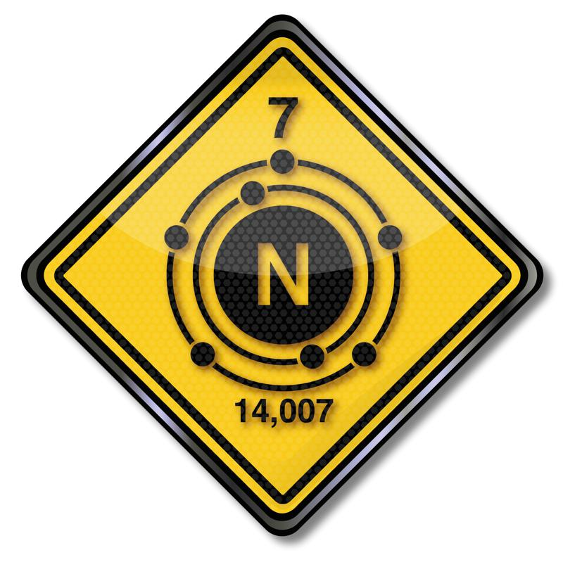
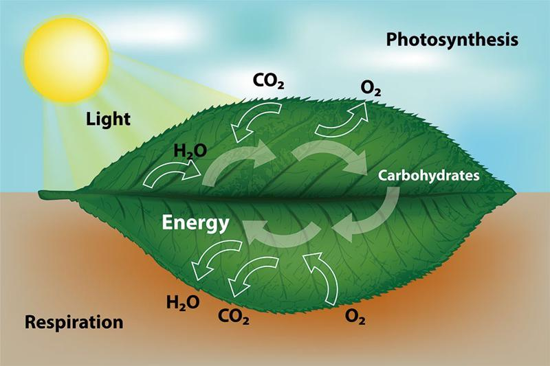

# 0101. 底层与连接：化学存在的终极理由是什么？

孙亚飞·化学通识30讲

2019-06-02

总结：说到这里，我们再回到这讲刚开始提出的问题：化学存在的终极理由是什么？现在也就有了答案。化学不可替代，是因为：1）化学关注现象与本质之间的联系，可以帮助我们更好地认识世界；2）化学填补了不同学科之间的断层；3）化学可以实现更多的可能性。

## 1.0

这是课程的第一讲，我们先来谈一个根本问题：化学这门学科，凭什么存在？

我学了二十几年化学，经常听到身边的人吐槽，说化学没有存在的必要。我居然觉得他们的想法，挺有道理。

你看，最近几年，诺贝尔化学奖的获奖人，干脆就没有化学家了。

2015 年和 2018 年，化学奖都颁给了生物学家。这也能理解，化学是生物学的物质基础嘛，倒也不是太大的事。

但是，物理学家居然也来插一脚。2017 年，化学奖就颁给了物理学家，奖励他们发明的冷冻电镜成功应用在了生物领域。这么一看，获奖者和应用领域都跟化学没什么关系了。

有人就开玩笑说，诺贝尔化学奖干脆改名叫「诺贝尔理科综合奖」得了。

那我们这门课，是不是刚开了个头，在这儿就得结束就了呢？肯定不行啊。

化学不仅有存在的必要，而且是必须有。

现在特别热门的新材料和新能源，比如石墨烯、光伏、可降解塑料等，都是靠化学才有了实现的可能。就是因为名称里没有「化学」两个字，人们才不清楚化学在里面的贡献有多大。其实，其他领域的前沿进展，一点都离不开化学。

再说了，诺贝尔化学奖成了理综奖，恰恰是因为，化学解决了其他自然科学解决不了的问题。

如果没有化学，我们现在所处的一定是一个分裂的世界：

现象和本质之间，是分裂的；

学科和学科之间，是分裂的；

理论和现实之间，还是分裂的。 

所以，化学是无法替代的。具体来说，我给你三个理由：1）化学通过独特的维度认知世界。2）化学能够连接世界的断层。3）化学可以实现可能性。

接下来，我跟你一个一个展开讲。

## 1.1 理由一：化学认识世界有独特的维度

《周易》里有句著名的话，叫做「形而上者谓之道，形而下者谓之器」。把这句话引申到自然科学里，正好能解释化学区别于其他学科，特别是物理的认知维度。

我们可以把「形」，理解成我们面对的现象。

化学的性格就是讨论现象和本质，在它们之间寻找关联，关注的是「形」本身，所以是「形而下者」。但物理的性格，却是追求原因和结果，有一个结果，就一定要找到一个原因。

所以，从这一点不难看出：物理更符合「形而上」，化学更符合「形而下」。

比如，物理会用波长来解释绿色。但化学，更多地关注绿色这个现象。

化学家道尔顿就是红绿色盲，也是第一个发现这种现象的人。红绿色盲的存在，说明同样的波长，对于不同的观察者来说，现象并不完全一样。

换句话说，波长是本质，绿色是现象，本质是现象的原因，却不导致唯一的现象。

红绿色盲的人很多，但是这个现象由化学家发现，偶然之中也有必然。因为重视本质与现象间的联系，就是化学独特的世界观。

健身这种小事，要是从化学角度来观察，说不定很多姑娘小伙减不下去脂肪，练不出来肌肉的问题，就很容易解决了。

经常健身的人也许知道，如果不注意配餐问题的话，就练不出一身好肌肉。因为肌肉的主要成分是蛋白质，需要有氮元素才能生长，但是我们平时吃的东西里，氮元素比例并不高。

所以，表面上看，健身长肌肉是个营养学问题，但我们再多想一层，其实这就是个化学问题。只要在饮食中补上氮元素这块短板，健身的目标就能早日实现了。

这不就是「木桶原理」吗？没错，发现这个原理的，还是个化学家，叫李比希。

他生活的 19 世纪，正好赶上了第一次工业革命，全球人口数量都增长得特别快。因为这个现象，欧洲还出现了粮食危机。怎样让农田变得更高产，成了当时的社会难题。

通过研究，李比希发明了化肥，说化肥能帮助粮食增产。可是，农民根本不信他。

李比希只好打比方说，一个木桶能够装多少水，取决于最短的一块木板。对于农作物来说，氮、磷、钾就是最短的那几块木板，过去土壤贫瘠就是因为缺乏氮、磷、钾。盲目施农家肥并不能改变这个状况，但是化肥可以做到。

这个解释浅显易懂，农民一下就理解了化肥的好处。这个比方也因此出名了，后来演化成我们熟悉的「木桶原理」。

为什么这么简单的原理是化学家发现的？这是因为，化学家承认一个事实，就是现象与本质之间的联系是复杂的，不只是因果关系。

就像木桶的短板确实让这桶水装得更少了，但短板只是其中一个理由，而不是原因。比如在南极，水冻成了冰块，短板就没什么影响了；要是到了太空，失重了，水也不会顺着短板流出来。

这么看的话，在因果性和相关性之间，化学其实更侧重解决相关性的问题，围绕着现象去寻找与它关联的本质。

## 1.2 理由二：化学能够连接世界的断层

每个自然学科都会对世界进行解释，但是这些解释往往是分层的。

你知道底层的规律，不代表就知道表层的规律。这就好比说，你知道一只鸟的行为，却不一定知道鸟群的行为。

不同层级之间的鸿沟谁来连接呢？化学。

我们刚才说到了绿色，而一说起绿色，你也许会想到植物里的叶绿素。

根据物理知识，我们能知道，叶绿素吸收太阳光里的红光，将互补的绿光反射出来，所以我们看到植物就是绿色的。

借助生物知识，我们可以搞清楚，叶绿素吸收红光实现了光合作用，把二氧化碳和水转化为葡萄糖和氧气。

这两个知识单独说，你都能理解。但是如果要连起来，说植物为什么能产生光合作用，那么物理和生物之间，还差着一个环节。

这个环节，就需要靠化学来补齐了。它用来连接认知断层的，是分子模型。

光合作用

叶绿素为什么要吸收红光呢？是因为它吸收了这个波长的光后，分子就会处于激发态。那叶绿素是怎么促成光合作用的呢？因为激发态的分子提供了能量，让光合作用得以进行。

是不是被一堆术语弄蒙了？我来打个比方，你就能理解了。

我们可以把叶绿素看成一个充电电池。太阳光照射过来的时候，它就开始充电。当然，充电也有门槛，这个门槛就是只能吸收红光，其他光吸收不了。这就解释了，叶绿素为什么是绿色。充完电以后，电池把能量转化成电能，就相当于开始进行光合作用了。

我再来举个例子。医学要是想应用物理知识的话，也需要化学在中间翻译和转化一次。

核磁共振你肯定听说过，在医学领域，它能对肌肉、血管、神经等很多部位的病变，作出定位定性的诊断。

它应用的，其实是物理学的一个原理，那就是「原子核在强磁场下的能级分裂」。可是医学不能拿来直接用啊，这时候又是化学来帮忙了。

化学利用原子核分裂的原理，能够确定组织的分子结构。而医学在分子结构的基础上，实现了成像技术，终于能观察到病变的部位了。
你看，要是没有化学来扮演连接者的角色，我们可能连最普通的生活都过不好。

## 1.3 理由三：化学能实现各种可能性

19 世纪，欧洲人满世界挖运河，还都赚翻了。不少人就嘀咕，不对啊，开挖运河不是件劳民伤财的事情吗？隋朝江山就是这么断送的呀。

这两者的区别，抛开政治不说，最大的因素就在于炸药的工业化。实现这个过程的，是你我都熟悉的诺贝尔。

19 世纪下半叶，他垄断了全世界的炸药技术。当时，挖运河、开隧道、修铁路等，每项工程都离不开炸药的使用。炸药不光能帮助节省人力，也加快了工程的推进速度。

据说，诺贝尔去世前的财富之多，足以把他送上世界首富的宝座。也因为如此，他才有财力去创立诺贝尔奖。

在诺贝尔生活的那个年代，有钱人几乎都是搞化学的。比利时人索尔维，因为发明了纯碱的生产方法，成了大财主。自然科学界最负盛名，拥有最著名科学家参加的索尔维会议，就是他创办的。

这么看起来， 19 世纪的化学圈，简直就是那个年代的「硅谷」。这些化学家们，跟硅谷的互联网精英们，其实没什么两样。

即使到了现在，人工智能这样的科技飞速发展，要想把这些技术落地到生产，还是需要化学来解决关键问题。

比如把人送上月球，需要面对零上一百多度和零下一百多度的极端温差，特别是低温的时候，一般材料都是脆性的，宇航服的材料怎么保持柔韧性，就要靠化学实现。

再比如全碳汽车，跑得更快，也更省油。它的主要材料碳纤维，没有化学帮忙的话，也根本不可能做出来。

还有很多事情，看起来是工程问题，背后还是化学问题。

3D 打印这些年很火，它有个重要的用途，是打印钛合金关节。你可能知道，目前植入人体最好的材料是钛合金，但是怎么让它和 3D 打印技术结合起来，化学又成了关键。

回到开头我们说到的，物理学家、生物学家霸占诺贝尔化学奖的事情，说到底还是他们在各自的学科领域遇到瓶颈了，而这个瓶颈，居然能用化学来解决问题。这不正是化学关键地位的体现吗？

如果用游戏角色打比方的话，化学更像是一个法师，可以实现各种可能性。打游戏的人肯定明白，要想出去打副本，缺了法师可就头疼了。

思考题：你在生活中也好，在工作中也好，曾经遇到过哪些问题，最后依靠化学来完美解决的呢？

下一讲，我会讲讲化学究竟是怎样认识物质世界的。通过这种方法观察到的，是真实的物质世界吗？