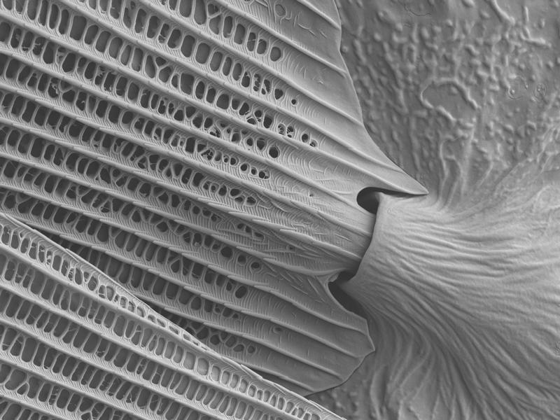
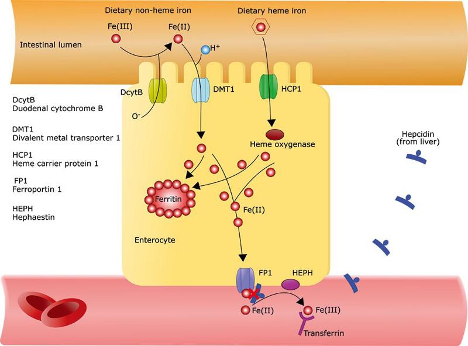

## 0102. 宏观与微观：化学从什么维度观察世界？

孙亚飞·化学通识30讲

2019-06-02

总结：1）宏观世界并不是微观世界简单的线性叠加；2）化学家们之所以用微观的维度去认知世界，不是为了理解里面的结构，而是为了理解它怎样影响到宏观世界。3）观察和解决问题的一个方式，那就是通过宏观现象，推测微观世界的本质，再利用这些本质规律，去解决宏观世界的问题。

### 2.0

上一讲，我们讨论了化学存在的三个理由，分别是通过独特维度认知世界、连接世界的断层，以及可以实现可能性。接下来的两讲，我就要通过全学科的视角，也就是化学思维，帮你完整地理解一个大问题：化学究竟是怎么认识物质世界，又是怎么形成了认知体系的？

我们可以把这个大问题拆分成两个方面：1）要想认识世界，首先得确保一件事，那就是，你观察到的世界是真实的吗？如果不是，那结果可靠吗？2）即便我们掌握的信息是可靠的，被我们处理成理论和规律之后，那这个信息还可靠的吗？主观认知和客观世界之间的矛盾，又该如何去化解呢？

理解了这两个问题，我们才可能从根本上知道，化学是怎样运作的，化学思维又是从哪几个维度去思考和解决问题的。今天这一讲，我们先来聊聊第一个问题，看看化学是从什么维度去观察这个世界，并且形成独立的认知体系的。

### 2.1

平时生活里，要观察一个看不见的东西，还要说出个子丑寅卯来，你肯定觉得不现实。有的时候，可能还会闹笑话。

2015 年，安徽省的高考作文题就引起过争议，主要内容是说，彩色的蝴蝶翅膀在电子显微镜下，居然是无色的。这道题一公布，立刻就有很多人调侃，说出题人没见过世面。

蝴蝶翅膀

为什么这么说呢？

蝴蝶翅膀本身就没有颜色，是因为利用了纳米结构的干涉效果，才产生了颜色。这在自然界实在是太普遍了。肥皂泡、CD 光面、汽车贴膜看上去五彩斑斓的，都是这个原理。而且，透过扫描电子显微镜去观察物体，别说是蝴蝶翅膀了，任何物质都不会有颜色。

所以较真地说，这篇文字材料的确存在一定的漏洞。

这道题也让人很好奇：为什么从宏观和微观角度观察到的世界，是不一样的？

我可以给你一个答案：宏观世界不是微观世界的线性叠加。

咱们中国古时候的思想家庄子，就说过一句很著名的话：「一尺之棰，日取其半，万世不竭。」意思是说，一尺的东西，今天拿掉一半，明天拿掉剩下一半的一半，每天都拿掉前一天的一半，总会有另一半留下，所以这尺东西，永远也拿不完。

在我看来，庄子其实很像一个数学家。他认为物质世界是个朴素的线性结构，微观世界就是缩微后的宏观世界。既然宏观世界没有不能分割的物质，那么微观世界也不会有。

但通过蝴蝶翅膀颜色的例子，我们就会发现：微观世界并不是宏观世界简单的微缩版。

如果你在流动的水里滴下几滴染料，就会发现，染料滴入水中的那一刻，有些染料反而会逆流而上，扩散方向与水流相反。这就是物质分子在微观层面的不规则运动，也叫「布朗运动」。而宏观层面，并没有这个现象。

反过来说，宏观世界的现象，微观也未必存在。天空是蓝色的，但你却找不到蓝色的分子，因为那只是光照在氮气分子上，造成的散射现象。

听到这里，你就会明白：要想认识世界，宏观往往是一种幻象，透过微观才能看到本质。

比庄子更老一点的墨子，就有着另外一套观点。他说：「非半弗斫则不动，说在端。」（出自《墨子·经下》）。

什么意思呢？就是一样东西每次都切一半，切到最后，再也切不了了，留下的就是物质的本源，也叫「端」。 从这里能看出，墨子理解的微观世界是不连续的，这和庄子不同。

现代化学家们的观点，建立在量子力学的基础上，跟墨子的差不多。在他们的观点里，原子就是所谓的「端」。在化学反应中，原子是最小的单位。

而化学研究的主要对象，就是化学反应。所以即使我们现在都知道，原子还可以继续分割下去，但在原子层面做研究，就已经足够了。

在宏观和微观层面，使用不同的研究方法，这样的思维，已经被很多学科借鉴。

比如在经济学领域，就有宏观经济学和微观经济学之分。没有别的，就是因为个体和整体之间的关系，是不能通过简单的线性叠加得出的，需要采用不同的研究方法。

### 2.2

其实，化学家们用微观维度去认知世界，不是为了寻找最根本的原因，而是为了联系宏观世界的现象和微观世界的本质。

比如说洗衣粉，你肯定很熟悉了。只要把脏衣服丢进洗衣机，再放一勺洗衣粉，搅上几十分钟，衣服就干净了。

如果你能带着洗衣粉的配方，穿越到一百年之前，轻轻松松就能靠它赚大钱，当土豪，走上人生巅峰。

没错，这么普通的洗衣粉，发明出来，居然还不到 100 年。

在这之前，古人常用的去污剂是肥皂，不少地区喜欢叫「胰子」，因为最简单的土肥皂，就是用猪的胰脏和草木灰混合做出来的。但是，肥皂用来洗衣服的话，去污效果并不好，比洗衣粉差远了。

为什么呢？要想弄清楚这个现象，就需要借助微观维度才能理解。

洗衣粉和肥皂的主要成分，在化学上都属于表面活性剂，但具体来说，还是有差异。

肥皂里的成分是硬脂酸盐，它有个致命缺陷，就是会和钙镁离子结合，产生沉淀。哪儿的钙镁离子最多呢？我们常说的硬水里。比如很多地方的井水就挺硬的，城市里的自来水，也未必有多软，北京的水也是挺硬的。

用这种水跟肥皂一起洗衣服，不但不容易洗干净，晾干之后，还可能会出现白斑。这就是前面说的沉淀。但洗衣粉就不会出现这样的问题。所以，我们带着洗衣粉穿越到 100 年前，才可能赚大钱。

你看，如果不能正确地从微观尺度认知世界，我们可能连洗衣服这么简单的事情，都理解不了。

虽然我们不能指望，通过一个分子或者一个原子，就能了解某个宏观物体的全部。但是要研究这个物体，还是得先知道它的微观结构。

这就好比是要想了解一个社会的真实状态，既不能抛弃微观的个体，又不能只关注个体行为。关注个体的行为，也是为了更好地认知这个社会。

### 2.3

这听起来有些矛盾，但化学的工作就是为了化解矛盾。

你一定还记得我们在第一讲里提到过，化学的性格是专注于现象与本质。这么说起来，其实它可以填补微观世界和宏观世界的断层。

举个例子，生活中，很多人都有缺铁性贫血，特别是女性朋友，遭遇这个问题的比例很高。

问题产生了，就得有解决办法嘛。

宏观上来看，这是贫血，就得补血。微观上看呢，血液的核心成分是血红素，血红素的核心原子又是铁。所以，贫血的解决办法，从微观上来看，就是补铁。

因此，回到宏观，只要是含铁量丰富的食物，都可以多吃，比如猪肝、鸭血、藕粉等。一般人说的吃红枣、喝红糖水呢，看起来就是过去人们「以形补形」的愚昧认知，应该抛弃。

但是，事情到这，并没有结束。

化学家通过实验，发现铁元素存在不同的化合价，也就是所谓的二价铁和三价铁。这两类铁元素，人体并不是能都吸收和利用。甚至说，过量的铁元素是危险的，过量的三价铁尤其危险。所以，从微观层面来看，补铁还不能盲目补，补的是二价铁才管用。

铁的吸收和代谢示意图

这时候，就得说到一个误会了。

很多孕妇发生缺铁性贫血以后，会去医院让医生开药，但是医生往往开的不是铁片，而是维生素 C。难道是碰到庸医了吗？其实不是。在血液里，维生素 C 是一种不可或缺的物质，它的作用之一，就是可以将有害的三价铁，还原成二价铁。

贫血了去补血，是生活中很普通的事。但这件事也能反映出，化学观察和解决问题的一个方式：通过宏观现象，推测微观层面的本质；再借助于本质，去解决宏观世界的问题。

从微观出发，化学给了我们更为全面的答案。也就是说，一味补铁的话，很可能就得不偿失了。那再回到宏观世界，贫血吃枣也是有好处的，因为鲜枣的维生素 C 含量，还是挺高的。

这些归纳起来，其实就是两句话：化学世界里，宏观是表面的现象，微观是内在的本质。

如果你不能正确地认识微观世界，那么你所看到的宏观世界很可能就只是幻象。

思考题：你遇到过什么事，用宏观和微观不同的维度去观察思考，最终会得出不一样的结果？

下一讲，我们会谈到认识世界还要进行信息处理。那怎样才能保证，我们处理的信息反映了真实世界呢？