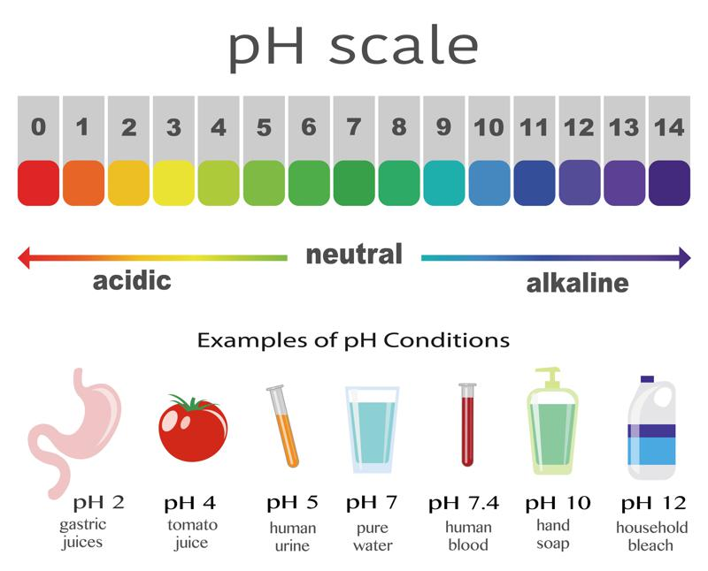

## 0305. 酸性与碱性：为什么酸碱性最容易被伪科学利用？

2019-06-11

总结：1）酸碱模型的第一个层次，是看物质的 pH 值，也就是氢离子浓度；2）酸碱模型的第二个层次，是看这种物质是接纳还是释放氢离子；3）酸碱模型的第三个层次，是看电子的位置，这真正连接了结构和化学性质的关系；4）酸碱模型有科学性，又很容易听懂，但它讨论的对象始终圈定在非生命体中，范围一旦扩大到生命体，就不具备讨论的基础了。这也是酸碱体质是伪科学的根本原因。

### 5.0

上一讲，我们知道了氧化和还原模型的本质，是物质结构与化学性质的关系，里面最关键的，在于电子的所有权。

这一讲，我们要说到的第二个物质化学性质的模型 —— 酸碱模型，同样得关注电子。只不过，在这个模型里，我们要关注的，就是电子存放位置的问题了。

我们还是老套路，从生活入手。你看，现在放开二胎了，很多家里老大是男孩的，就特别想要个女儿，凑个子女双全的「好」字。为了实现这个目标，很多爸爸妈妈就到处查资料，听说了酸碱体质的概念，他们发现，只要把自己调理成碱性体质，就可以生女儿。这样还一举两得，顺便改善一下身体状况。因为据说碱性体质就健康，酸性体质就不健康。于是，海带、豆角、菠菜等等，这些食物碱性比较强，他们就天天换着花样吃。又听说熬夜会让身体酸性提高，恨不得每天晚上八点就上床睡觉。

可是，酸碱体质这种说法，靠谱吗？当然不靠谱了。去年 11 月，「酸碱体质」的创始人罗伯特·欧·杨自己都在美国法庭上承认，「酸碱体质」就是个骗局。但我同时想告诉你，化学里面确实有个关于酸性碱性的模型，而且经过了化学家们的验证和完善，是有科学性的。那么问题来了，既然都是酸性碱性，为什么酸碱体质反而不靠谱呢？换句话说，为什么酸碱模型会被伪科学盯上呢？

要想弄清楚这个问题，我们得先知道酸碱模型是怎么来的。所以在这一讲，我会分三个层次来为你拆解。

### 5.1

先来说第一个层次，酸性碱性究竟是怎么来的。

最早的时候，酸性和碱性都是人们从生活中总结出来的经验。酸性物质，就是指吃到嘴里会发酸的东西，比如醋、柠檬，等等。碱性物质呢，就是能中和酸味的物质，比如苏打水，等等。

酸碱性就是这么接地气，谁都听得懂。不过，单凭味道来说酸碱性，未免太狭隘了。每个人的感觉都是不一样的，要是一种物质，你说酸，他说不酸，那怎么区分呢？所以，确切的定义还是有必要的。

化学对酸碱性就有独特的定义，它是通过微观维度来构造的。经过研究发现，酸性物质都有个共同特征，那就是氢离子的浓度比较高。氢离子，就是氢原子失去一个电子之后的物质。

从氢离子的视角上看，我们的舌头会感觉到酸味，是因为氢离子能跟细胞的蛋白质结合，这就给味觉神经发出了酸的信号。碱性物质之所以能中和酸，也是因为它能跟氢离子发生反应，其中起作用的是氢氧根，也就是 OH-，跟氢离子反应得到水，而水是中性物质。这个定义就很简单了，必须要在水里面探测到氢离子，才能判断酸碱性，这就是酸碱模型的第一个层次。

这样一来，物质的酸碱性很容易就能测出来了，怎么测呢？用 pH 试纸。pH，p 是一种算符，H 就是氢的符号，所以 pH 其实就是氢离子浓度换算后得到的一个数字。数字越小，代表浓度越高。pH 试纸可以产生不同的颜色，pH 值小的时候，它是红的，大的时候，就是蓝的。这样就能知道物质的酸碱性了。如果用 pH 试纸去测的话，水的 pH 值是 7，那么只要 pH 值低于 7，就是酸，反之，就是碱。

常见物质的 pH 值

因此，测定物质的酸碱性，用 pH 试纸就够了。

刚才我们说的，都是从四百年前，就逐渐被人们熟悉的观点。不过，我们也一直在这门课程里说到，很多既定的规律碰到特殊情况，可能就不准确了。酸碱性拿 pH 值来测，就遇到了这样的情况。

### 5.2

一个最简单的问题，就能把 pH 值判断酸碱的方法推翻。比如，把水加热到沸腾状态，也就是 100 摄氏度的时候，水的 pH 值就变成了 6。6 比 7 小，这时候的水变酸了吗？没有。

这是因为，一方面，水的温度升高后，水分子分解出的氢离子变多了，pH 试纸只管测氢离子数量，所以数值肯定是变小了。但是，另一方面，水分子分解后的氢氧根也变多了，它中和掉氢离子，所以水还是中性的。再比如，自热小火锅里都会有一包生石灰。要想测它的酸碱性，也挺难的。因为 pH 试纸要在液体里测才有效。但生石灰跟水一接触，就会马上起反应，生成熟石灰。这个速度太快了，都来不及测，就反应完了。

你看，很多事情理论上是成立的，但是实际操作起来，特例太多了。所以啊，化学家们对酸碱模型进行了升级。这就进入我们要说的第二个层次，也就是质子酸碱理论了。

这个模型其实并不复杂。我们在第一个层次提到过，氢离子是氢原子失去一个电子后得到的粒子。但是呢，因为氢原子只有一个质子和一个电子，所以在这里，我们也就可以把这个质子等同于氢离子来看待了。

化学家们发现，酸碱模型还可以从质子的角度来解释。具体说的是，一种物质，能够电离出氢离子的，就叫酸；能够接纳氢离子的，就叫碱。这是一种更接近本质的视角，化学家是从物质结构的角度去看酸碱性了，而不是只去探索氢离子本身。

听起来好像没什么区别，但我给你打个比方，你就懂了。用最初的酸碱模型，就像是普通的门锁和钥匙，我们第一时间想到的，就是用钥匙插入锁孔，才能打开。质子酸碱模型呢，就好比是密码锁和数字密码，你按几个数字就能打开。这套系统还是叫锁，重点不在于外形什么样，而在于功能是上锁。

质子酸碱理论，就是从功能出发得出的模型。到这里为止，酸碱模型完成了第一次升级。但是到这一步，化学家们发现，这个模型还是有问题，因为不是所有物质都含有氢离子。所以，就必须要进行扩展。

### 5.3

这就到了我要说的第三个层次了。

和氧化与还原模型的逻辑一样，化学家以电子为抓手，从结构出发来确定化学性质。第二次升级后的酸碱模型，我们叫它酸碱电子理论。理解这个理论需要很专业的知识。但我们普通人不用学到那么深，只要记住下面的这个比方，就足够你理解了。

我们还是把电子比作钱，来讲述最直白的原理：储户把钱存到银行的话，钱的所有权没有变，还是储户的，但钱存放的位置变了。套用到酸碱电子模型里看，就是有的原子像储户，有的原子像银行，提供电子的储户就是碱性，接收电子的银行就是酸性。这需要根据具体的场景去判断。

比如说，水和盐酸结合，水就是提供电子的一方，是储户，所以这时候它是碱性的。水和氨气接触的时候，水就是接收电子的一方，是银行，这时候，水又变成了酸性。

到这里为止，是化学对酸碱模型最完整的解释。了解清楚了这三个层次，我们就可以回答这一讲开头提出的问题：酸碱性为什么容易被伪科学盯上呢？

这是因为，酸碱模型一再扩展，也产生了一个致命的弱点，当然了，这不是模型的致命弱点，而是模型背后思维模式的弱点。那就是，什么事都可以用二元分类方法来解释。对客观世界进行二元划分，这是常见的辩证思维。不过，辩证归辩证，范畴可不能搞错了，否则二元思维的基础很可能就消失了。

任何一组概念，科学上都会对范围作一个明确的界定。比如我们前面谈到的那三个酸碱理论，范围虽然越来越大。但在化学上，讨论的对象始终是非生命体。一旦有人把酸碱模型的适用范围扩大到生命体，就不具备讨论的基础了。

酸碱体质的伪科学性，就是这么来的。酸碱体质的核心观点，是认为人体分为酸性和碱性，酸性体质容易生病，碱性体质是健康的，多吃酸性食物，就会变成酸性体质，所以为了健康，我们要多吃碱性食物。生命体当然也是由化学物质构成的，但是生命本身，还有很多其他的生理作用是不可忽视的。

可能这么说，你还不太容易理解，那我们举个最常见的例子。根据生物属性，我们可以把人分为男性和女性，而且这里面证据很多，比如染色体不同，或者女性可以怀孕而男性不能，等等。这是我们都熟悉的二元命题，但它只局限在生理方面。如果在社会学层面强行解释男女的差别，比如鼓吹男性擅长商业活动，女性擅长在家带孩子，所以男性应该获得更高的酬劳，女性应该当家庭主妇，这类说法就站不住脚了。

酸碱体质的骗局，就是同样的套路，它把酸碱的科学模型，通过话术包装，转化成健康与不健康这样一组概念，这就和性别歧视者鼓吹男强女弱是一个性质。唯一不同的是，对于性别问题，绝大多数人都觉醒了，但是对于酸碱这样的化学模型，真正知道的人却不那么多，于是被障眼法蒙住了双眼。

多说一句，对于非专业人士而言，识别出模型的科学与否，也是至关重要的。一句话总结就是：多看书，少联想，紧扣定义分析，不跨领域应用。

思考题：我们在这一讲说到了二元命题，你还知道哪些事情，单纯用二元命题来定义，其实是不靠谱的，原因又是什么？

下节预告：下一讲，我们将进入关于物质形态的化学模型，第一个会讲到的，是有关固体的模型：晶体与非晶体。

### 黑板墙

失电子是碱性，得电子是酸性。失电子是氧化反应，得电子是还原反应。我是否可以理解为，至少对无机物而言，氧化反应的物质呈现碱性，而还原反应的物质呈现酸性？

作者回复：这个理解有偏差。酸碱的电子并不是转移，不是分配，而是从一个原子进入另个原子的轨道，因为这个比较抽象，所以我才打比方，像存钱一样，电子的所有权并不发生化。2019-06-11

2『这一节的酸碱概念，做一张术语卡片。（2021-09-18）』