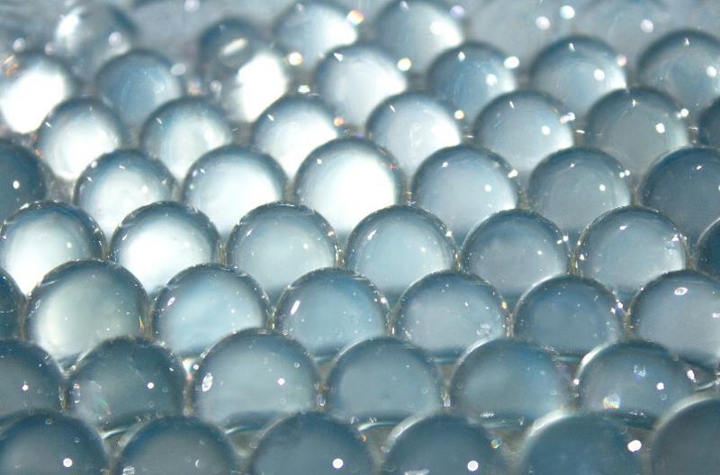

# 0508. 膨胀与收缩：凝胶如何改变了我们的健康观念？

孙亚飞·化学通识30讲

2019-06-25

如果你还记得的话，我们在第二十讲曾经说到了化学材料的第三个设计原理跟尺寸相关，解决的是设计过程中，界面和本体的问题。

在上一讲，我们说到了黏合剂这种材料，它研究的就是材料的界面。这一讲，我们要谈到的化学材料就正好相反，研究的是材料的本体。

这种材料，叫作凝胶，也是一种高分子化学材料。「凝胶」这俩字，听着有些像术语，好像离我们的生活有点远，但其实，你绝对没少见过它。

果冻、凉粉、豆腐，等等，在化学世界里都属于凝胶材料。女生用的化妆品也有不少属于这个范畴，比如说面膜上的精华液，关键成分也都是凝胶材料。

说起来，凝胶不光早就渗透进了我们的生活，它本身，还跟我们的身体健康有很强的关联性。为什么要这么说呢？你听完这一讲，知道了凝胶的一些特性，自然就明白了。

跟之前一样，我还是按照结构、特性和应用这三个层次来解释。

## 01

第一个层次的问题是，凝胶究竟是什么？

不知道你有没有自己尝试过做果冻呢？这个过程很简单，就是把吉利丁放到煮开的水里慢慢溶解，之后放着冷却，就能得到果冻了。

相信你已经听出来了，这个过程里，让水变成果冻的功臣就是吉利丁。它的英语叫作 gelatin，翻译成中文就是凝胶，也叫作明胶。所以，吉利丁就是一种凝胶产品。

市面上的吉利丁，主要成分是胶原蛋白，从微观层面看，它的分子非常大，溶在水分子里之后就会舒展开，就好像是一个个八爪鱼一样。

不光形状像，胶原蛋白还跟八爪鱼一样有吸盘，这个吸盘，就是有吸引力的分子基团。这么一来，每个胶原蛋白分子互相之间，通过吸盘勾连在一起，在水里形成了一张巨大的网，水分子就填充在这些网的空间里面。呈现到宏观上的状态，就是形成了果冻一样的凝胶。

因为用的是水，所以这种物质也叫水凝胶。水凝胶只是凝胶材料中的一个大类，其他的，还有硅凝胶、酒精凝胶、金属凝胶，等等。

在这里面，水凝胶是最常见的一种。为了方便理解，我们接下来所说的案例，就以水凝胶为主。

从微观上看，凝胶的材料里，很大的分子和水分子之间，形成的都是这种网络状结构。

这种结构没有那么稳固，组成各种分子的原子，互相之间的位置也会发生变化，就像八爪鱼的触手会晃动那样，体现在宏观上，就是会发生变形。这和橡胶有点像。

但是，果冻吃起来不像口香糖，我们切豆腐的时候，也没有切轮胎的感觉。所以，凝胶也只是看起来像橡胶，但本质上，和橡胶还是有所区别的。这是因为，凝胶在形成过程中，原材料里面的高分子只有很少的一部分，像水这样的小分子占了绝大多数的位置。

比如，果冻和豆腐里的水占比在 90% 左右。但这些都不算什么。很多化妆品里的玻尿酸，也是一种凝胶材料，学名叫透明质酸。它的水分比例，可以达到原材料的 1000 倍以上，换句话说，玻尿酸的含水量差不多有 99.9%。

你看，凝胶内部是小分子占多数，分子小，就意味着分子互相之间的作用力就小，所以凝胶内部的结合力，就比橡胶要弱得多。

## 02

我们一直在说，结构决定性质，既然凝胶的微观结构已经搞清楚了，那我们接下来，就来说说凝胶这种材料有什么特性。

你可能听说过一个段子，说做豆腐是最好的工作，因为怎么做都行，做稀了是豆腐脑，干了就是豆腐干，就算放坏了，还可以是臭豆腐。

段子归段子，这里面有一点确实没说错，那就是把豆腐晾着，就可以做成豆腐干。

豆腐是一种初级的凝胶，从宏观上来看，它变成豆腐干，是体积缩小了很多。但如果从微观层面去观察的话，就会发现，里面的水分蒸发以后，分子的网络结构就收缩起来了。对豆腐来说，这种收缩是不可逆的，所以，豆腐变成豆腐干以后，就不能再恢复了。但我们前面说的玻尿酸，内部的网状结构既可以变大，也可以变小。

我们从这里面可以看到凝胶材料的一个明显特性，那就是，它的体积能够膨胀或缩小。这个原理很简单，就是里面像水这样的小分子，它的含量发生了变化。

这对我们的健康来说，有很高的启示意义。

我们都知道，膳食纤维很重要，特别是水溶性膳食纤维对健康有帮助。这里面的原理，就跟凝胶有关系。水溶性膳食纤维其实也都是凝胶原料，比如果胶、低聚木糖等等。它在肠道里面吸水膨胀后，就形成了凝胶状态，这样一来，我们的大便就能变得饱满，排出体外也能更顺畅。要是没有凝胶的膨胀作用，便秘或者大便干燥就是常态了。

除了体积会发生变化，凝胶的另一个特性，是可以随着膨胀或缩小的过程，吸附或释放一些化学物质。

吸附这个特性，听起来好像跟活性炭的功能很像啊？但实际上，凝胶的机理不一样，它不是物理吸附，而是通过化学结构完成。比如，污水处理中最常用的一种凝胶材料，叫作聚丙烯酸钠，它可以很有效地通过化学吸附，吸收污水中的重金属。

释放这个特性呢，说的是在排水的过程中，凝胶材料也可以释放一些物质。

比如，虽然说水凝胶的主要成分是水，但和水最大的区别在于，它释放化学物质的过程非常缓慢，换句话说，就是水凝胶具有缓释的功能。

很多面膜说有美白的功效，实际上就是生产商在面膜的凝胶里面，加入了一些美白成分，根据凝胶的特性，这些成分能够在敷面膜的时候缓慢释放出来。

从这点来看的话，面膜对皮肤起真正作用的，反而是这些成分。

不过，因为现在很多面膜还会添加防腐剂，凝胶的这种缓慢释放作用，也会把防腐剂释放出来，这里面的一些成分也会对皮肤有刺激（参考资料1）。

## 03

说到这里，我们已经知道了凝胶材料的结构和特性，那么在这一讲的第三部分，就能去回答开头提出的问题：为什么凝胶跟我们的健康有关系呢？这是因为，它的性质和我们的人体很亲近，同时又能携带并释放一些有效成分。

凝胶里，除了水凝胶这个大类，还有一大类叫作硅凝胶，它的主要成分是含有硅元素的有机物，用的小分子也不是水，一般是像液体石蜡之类的溶剂。

这种硅凝胶材料有个很重要的用途，就是做成隆胸假体。经过这些年的发展，目前隆胸手术，一般都是用它，借助的原理，当然也是因为它加了一些化学物质之后，体积就会膨胀。膨胀之后的硅凝胶和果冻之类的水凝胶很像，松软而富有弹性。

充入假体中的化学物质，正如前面所说，一般都是一些有机物，比如早些年流行的石蜡。这就带来了一个问题，一旦植入了隆胸假体，凝胶破裂之后，这些物质也会进入到身体里面，对身体造成很强的伤害。

从化学材料的角度来说，其实技术发展到现在，我们已经能够做到让这种凝胶在受到外力的时候，不发生破裂。但是我们一直在说，世界是复杂的，人体也是如此，所以植入假体的手术，难度并不低。

也正是因为如此，即便是质量过关的硅凝胶假体，在植入体内之后，发生破裂的也不在少数。这一点，国内外的情况都不太乐观，可能你注意过，有的人隆胸之后坐飞机，就发生了破裂。再比如说，国内辽宁人民医院做过一次调查，用仪器扫描，结果 18 个志愿者一共 36 个假体，有 8 个假体发生了破裂，只是肉眼还看不出来（参考资料2）。

不过，即便有这样那样的问题，也不能否定凝胶用于医学的特殊价值。

因为凝胶的缓释特性，现代治疗技术已经越来越多地采用这种材料做药物缓释。

长期卧病的人很容易产生褥疮。这是一种并发症，产生的原因是，身体下方的皮肤压得太久，造成组织坏死。

褥疮治疗起来非常困难，因为坏死的这部分皮肤总是处于流血的状态，不光是影响治疗过程，一不留神还会再次感染。好在，现在在临床上，出现了一种水凝胶的治疗方法，就是把药物溶入水凝胶里，再涂抹到褥疮上，通过凝胶的缓释特性，药物就能帮助止血，防止感染了。我所在的课题组，就做过水凝胶材料，用于重度糖尿病人的褥疮治疗。

再比如，眼球手术需要非常精细的技术，在手术之后，需要保持眼球的状态，这个时候，能够吸水膨胀的凝胶材料就成了好帮手，它可以借助于膨胀的特性，起到支撑的作用，时间久了之后，自然收缩，最后被身体吸收代谢，不会造成伤害，也不用专门再取出来，前面说到的透明质酸，就经常会被用到。

就连万病之王癌症的治疗过程里，凝胶也已经开始发挥作用了，主要原因也是它的缓释作用。

我相信，对于未来的医疗和美容而言，凝胶发挥的作用还会更加重要。

## 总结

第一，从微观上看，凝胶材料的内部结构，就是原料的高分子构成网络，由小分子填充在网络之间。

第二，凝胶的特性，是能够吸收或者释放小分子，因此它的体积能够膨胀或缩小，在这个过程中，吸收或者释放化学物质。

第三，凝胶能够改变很多医疗手段，不过，即使从化学材料的角度看，我们能提高它的安全性能，但实际应用过程中，也会面临不少缺陷。

思考题：

我们吃的东西里面，很多都是凝胶，除了果冻、凉粉和豆腐，你还知道哪些呢？

下节预告：

化学材料模块，到这里就全部讲完了。下一讲，我就要开启新模块化学应用，说一说在实际应用中，化学产生了哪些问题，又是怎么解决问题的。

## 参考资料

1. 《化妆品配方科学与工艺技术》，张婉萍主编，化学工业出版社

2. 《3.0T MRI对硅凝胶乳房假体及假体破裂的诊断价值》，马强等，中国美容整形外科杂志，2018，12，736-738