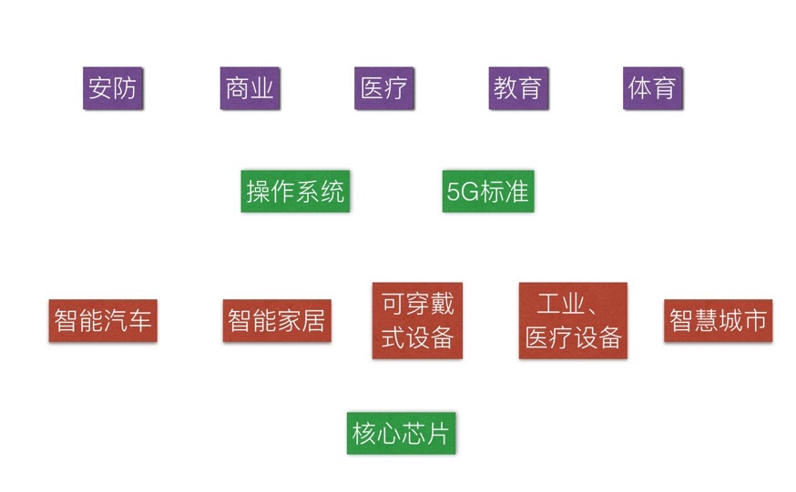

# 0501. 机会与骗局：如何判断新技术的可靠性？
> 前沿科技之吴军讲5G
2019-07-24

我们上一讲介绍了 5G 巨大的市场，并且把它的商业架构搭了出来。

这一讲，我们看看在这个市场中，到底哪些是可预期的机会，哪些是炒作起来的骗局。

我们还是用下面一张图把这个架构再给大家展示出来，在图中我没有指明具体的企业，因为每一个位置都可能诞生一家大公司。



在这个架构中，每个人都能找到自己的位置，处于核心技术那条主线（绿色模块）上的从业者，和 IoT 和 5G 设备相关的从业者，将来的位置比较好确定，但是更多的人可能是从应用入手，因此，我并不是说需要每个人都从事 IT 行业，而是说大家需要想一想自己的工作如何借这些技术的势。

接下来我就给大家举几个真实的案例来说明一下，它们看似离科技产业都比较遥远，但是却能受益于新技术。

第一个例子是我的一位同学，上海一个著名的投资人所投的项目。就是用 IoT 及早发现猪瘟，控制疫情，减少损失。我们知道，今年有些地区爆发猪瘟疫，不得不杀掉大量的猪，这给猪农和保险公司都带来了很大的损失。

控制猪瘟损失的一个有效的办法是在第一时间发现感染病毒的猪，并且杀掉那一栏猪，避免瘟疫的传播。这件事靠经验是做不到的，因为人在猪发病的开始阶段看不出征兆。但是如果给猪测体温，并且监视其进食，这件事可以做到。

2017 年国内一家做 IoT 的企业获得了我的同学高额的风险投资，该企业给每一头猪装上了可穿戴式设备，并监控猪的体温，再通过其它 IoT 设备监控猪的进食情况和日常活跃程度。在猪栏的上方安装了能接收相应信息的设备和红绿预警灯，一旦发现某只猪体温异常或者生理活动异常，预警灯会马上预警，猪农可以在第一时间采取行动。

第二个例子和体育比赛相关。2019 年，虽然勇士队输掉了 NBA 总决赛，但是它的表现依然可圈可点。在 2018-2019 年赛季西部的半决赛中，勇士队的主力、两次 FMVP 得主杜兰特受了伤，大家都在担心它能否再次闯过老对手火箭队那一关。

但是令人吃惊的是，勇士队在没有杜兰特的情况下居然还有一套外界并不了解的全新打法，甚至它的板凳队员上场后表现都很出色，而且配合极为娴熟。随后，它又轻松地战胜了开拓者队获得了西部冠军。如果不是因为汤普森也受了伤，要靠库里一个人支撑全局，它极有可能蝉联总冠军。

那么勇士队是如何做到替补队员能够像主力队员一样表现呢？其实它的备份战术在平时训练时早就练就了。在训练时，勇士队使用了两个高科技的产品辅助训练，第一种叫做 SportVU，它是数据采集的工具，你就把它简单地理解为在篮球场四周装上很多的智能摄像头就可以了。

我们知道今天城市里的安防摄像头不仅能识别人，还能跟踪人的踪迹，SportVU 也会识别球员，会跟踪每一个球员的表现，记录传球配合的准确率，过人的效率和投篮的命中率等等。

第二种辅助工具是大数据处理和智能决策工具 MOCAP，它根据数据指定战术，而运动员们平时训练，就是将这套由机器智能帮助制定的战术练熟、练好。因此，奥巴马讲，勇士队打破了这项运动的格局，这似乎是不公平的比赛。很多人则认为，勇士队是 NBA 里的 Google。

不仅球队训练如此，个人训练也得益于今天的跟踪技术。今年著名高尔夫选手老虎伍兹在时隔 14 年后，再次获得大师赛冠军，和他同场竞技的很多人都是小时候看着他打球的录像长大的。今天很多优秀运动员的运动寿命特别长，这也要感谢跟踪技术，比如可穿戴式设备让他们减少了受伤的机会，而其它一些辅助工具让他们能够更有效地训练。

今天，伍兹等人在训练中普遍采用一种被称为 TrackMan 的工具，它除了测定高尔夫球运动员的表现，还装有了几万个高尔夫球场的数据，可以让运动员在比赛前模拟场上的比赛。高尔夫球的比赛和其它球类不同，所有的球场的赛道完全不同，每一场比赛的战术要根据球场而定，因此是否熟悉球场，会使得成绩相差很远。

过去，职业高尔夫运动员在赛前也只有一次熟悉球场的练习，不少人因为对球场不熟悉发挥不好。因此，所有的职业选手和好的业余选手，都会使用 TrackMan 在比赛前熟悉球场的情况。这种技术手段让高尔夫球比赛的成绩在过去的十年里有巨大的提高。

在 IoT 高度发达的未来，技术水平将在很大程度上决定一个人能否得世界冠军。而当一个选手率先采用了新技术后，其他人必须跟上，这样整个产业就发生了变化。

美国最大的移动通信运营商 Verizon 把 5G 的应用概括为了八大模块，它们分别是：

```
节能

（人的）跟踪

移动大数据

IoT

实时服务

商业系统升级

高速网络应用

高可靠性网络应用
```

关于前四个：（智能家居的）节能、跟踪、IoT，我们前面已经讲了，就不再解释了。

至于第五项，实时服务，车联网是一个很好的例子。今天虽然你可以从手机地图服务中了解交通路况信息，但是因为有延时，而且你不知道其他人的意图，常常是大家都在一个红色的拥堵道路上，看到旁边一条绿色的车道，都抢过去，结果是走到哪里哪里堵。

我曾经有过这样一次经历，一位朋友用他的智能汽车接我从上海虹桥站到徐家汇，一共只有十来公里的距离，当时还没有到交通的高峰期，他居然走了两小时，原因是那辆汽车所指示的永远是最堵的道路。

这其实是我们今天移动互联网中缺乏实时服务的结果。所有汽车要将信息传给百度或者高德这样的服务商，等它们给出建议，早已经是过时的了。

实际上，所谓实时的服务，需要的是，让周围的汽车能相互通信，彼此知道对方的意图。这就如同你在商场排队，又开了一个窗口，并非每一个人都会挤过去，因为大家看到别人的意图后，知道怎样作出最优化的决定。

实时服务之后的第六大应用是商业系统升级，这比较好理解，比如今天的收银机要么需要连线，要么需要连 Wi-Fi 的，但有了 5G 之后，就可以完全利用移动互联网通信了。此外，无售货员商店的自动售货，带有 RFID 标签的商品经过扫描器，都可以用到 5G 技术。

第七大应用，高速网络的应用也很好理解，毕竟 5G 的一个明显的特征就是比 4G 快。在 5G 的时代，在一个小区里，大家同时用 5G 看视频是做得到的，今天不仅 4G 做不到，你家里多来了几个小朋友，他们同时在玩游戏和看视频，都有可能卡顿。

5G 的高速度还给 VR 带来了希望，今天的 VR 之所以发展不起来，网速是一个巨大的障碍。关于 VR，我们接下来会专门讲。

至于最后一大应用，可靠性网络，它的逻辑是这样的：由于未来 5G 的网络覆盖性会更好，不太容易出现掉线的情况，加上加密技术的改进，以及不再需要通过 Wi-Fi 或者热点上网，安全性也会提高，因此它有可能做一些今天必须由宽带有线联网才敢做的事情，比如金融交易等等。

今天在美国大部分公司，不允许用公网处理企业的业务，特别不允许用诸如星巴克等免费的 Wi-Fi 登录公司内部的网络，因为今天很多 Wi-Fi 和热点非常不安全。以后，移动设备直接和基站进行加密通信，可靠性要好很多。

今天你如果在媒体上看到上述这些 5G 的应用，都属于技术能够达到的范畴，而且有着商业的需求。但是今天也有不少关于 5G 的报道其实只是宣传的噱头，甚至一些公司所宣传的 5G 是所谓的伪 5G，仅仅是商业炒作而已。那么我们怎么判断呢？我们不妨用三个标准来衡量一下：

首先，任何一代移动通信技术的进步，都会带来数量级的改进，也就是 10 倍以上的改进，达不到这个要求就是假的。为什么每一代改进要有这么大幅度的提升呢？因为在发展迅速的 IT 行业，30%、50%，甚至一两倍的提升不足以确立在市场上的优势。提升一个数量级就是革命性的进步，就足以产生可碾压的优势。

其次，在 5G 的说明中是否夹杂了私货。比如前一阵子在美国被大家嘲笑的伪 5G 手机，用了 5Ge（后面加了个小写e）的标识。不要小看这个字母 e，它是进化 evolution 的缩写，意思是向 5G 进化，其实是 4G 的增强版。我们下一讲会讲到 5G 的技术和布局、建设的时间等等。在 5G 真正到来之前，这种伪 5G 会层出不穷。

最后，就是把试验测试当作商业效果来宣传。今天你可以看到媒体上有很多宣传，几秒钟下载了一部电影等等。那些只是理想状态下的测试，基本上一个基站的带宽都供给了测试的手机。如果同时有 1000 部手机上网，网速就远没有那么快了。

事实上，4G 的极限速度应该能够到每秒 1Gbps 左右，也就是说一分钟下载一部高清电影，但是大家谁也没有体会过这么快的网速。目前国内虽然发了 5G 牌照，而且有一些可以用做测试的样机供大家使用，但是由于 5G 网络的布局刚刚开始，除了在基站附近能测到较快的速度外，稍微远一点的地方效果就和 4G 差不多了。

此外需要指出的是，根据国际标准化组织 3GPP（第三代合作伙伴计划，负责制定移动通信标准）对于 5G 的描述，不仅需要宽带大、速度快，还需要做到高可靠、低时延连接，以及支撑海量并发设备，后两者都还没有测试。

应该说，5G 给大家带来了很大的想象空间，但是目前才仅仅是起步阶段，大部分用 5G 做噱头的宣传都是在炒作。至于 5G 什么时候完成布局，让我们可以享受到，这是我们下一讲要谈的内容。

三个特点判断 5G 技术的真伪：

1. 宽带大、速度快；

2. 还需要做到高可靠、低时延连接，

3. 支撑海量并发设备。

满足了这三条才是真的 5G，还要特别说明的是，测试的结果和商业运行的结果是两回事，我们能够得到的是后者，因此要谨防别人用 5G 炒作，自己上当受骗。

预告：

下一讲，我们再提高一个维度，看看世界各国都是在如何布局 5G 的。我们下一讲再见。

