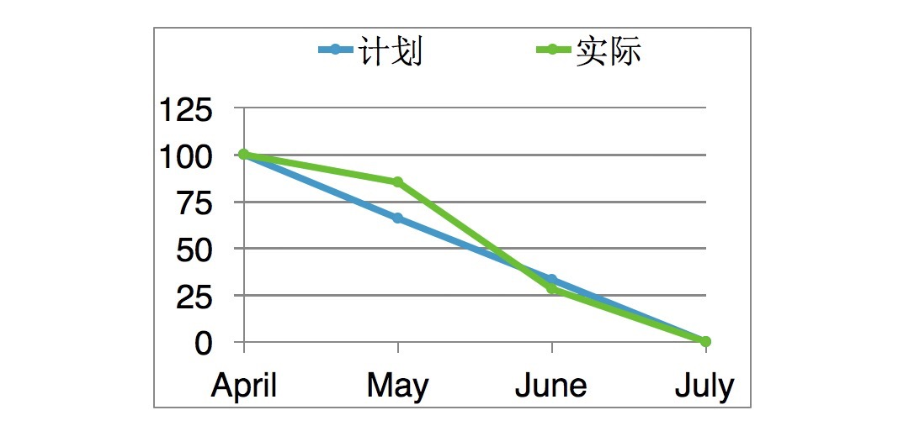

# 1114. 2017 年我的目标，顺便介绍谷歌的目标管理方法

吴军·硅谷来信 | 第 114 封信丨

2017-02-03

前一阵子我总结了一下 2016 年所做的事情，节后第一个工作日，和你分享一下我在 2017 年想做的事情。在介绍具体想法之前，先给你介绍一下 Google 的目标管理方法。

Google 的每个员工每个季度都需要给自己定一个或者几个目标（Objectives），以及衡量目标是否达成的关键结果（Key Results），这几个词合在一起被称为「OKR」。每个人的 OKR 会放到自己的网页上，大约半页纸长，大家都可以看到。如果谁没有制定 OKR，一目了然，即使没有人催你，大家看到你的网页上面是一片空白，你自己都不好意思。到了季度结束时，每一个人会给自己的目标完成情况打分。完成了，得分是 1。部分完成，得分是 0 到 1 之间一个数字。

Google 强调每一个人制定的目标要有挑战性，因此如果一个人完成目标的得分情况总是 1，并不能说明他工作好，而是目标定得太低。大部分情况下，大家完成目标的得分在 0.7-0.8 左右。当然，一个季度开始的时候的想法，和后来完成的任务可能会有差异，早期没有想到的事情后来可能做了。

因此，在总结季度工作时，可以增加当初没有制定的目标，对于不打算完成的目标，或者已经过时、不再有意义的目标，不能删除，但是可以说明为什么没有做。今天我就按照 Google 制定 OKR 的习惯，介绍我在 2017 年的目标。

## 01. OKR 汇总

### 目标1. 完成《数学之美》的英文版和韩文版，《大学之路》第二版 

关键结果1.1 —— 找到英文版的出版商。

关键结果1.2 —— 寻找合适的、母语是英语的合作者，修改英文版的书稿。

关键结果1.3 —— 完成英文版的写作。

关键结果1.4 —— 争取年底前出版。

关键结果1.5 —— 配合韩文版的出版商，争取年底前出版。

关键结果1.6 —— 完成《大学之路》第二版，补充公立教育的内容，增加关于「伯克利」的一章，增加有关大学申请的内容。更换一些照片。四月底完成修改，争取 9 月份之前面世。

### 目标2. 将《硅谷来信》的部分内容完善，整理成书并出版

关键结果2.1 ——（六月份开始）选择三个题目（方向），每个题目 20 封来信。

关键结果2.2 —— 对于所挑选的这 60 封来信，补充材料，每一篇拓展成大约 5000 字完整的内容。

关键结果2.3 —— 8 月底完成初稿，争取年底前出版。

### 目标3. 更新在商学院的讲课内容，完成 60 小时教学量

关键结果3.1 —— 将去年在一些场合讲的新内容整理成课件，春季学期在上海交大试讲。

关键结果3.2 —— 将这些内容按照主题分成大约三个 1.5-2 小时讲座的内容，以便以后在讲演中使用。

### 目标4. 按照协议完成《硅谷来信》

### 目标5. 完成丰元资本第三期融资（恕不能透露细节）

### 目标6. 完成旅行计划和整理摄影照片

关键结果6.1 —— 去欧洲一趟。

关键结果6.2 —— 驾车在美国西部转一圈。

关键结果6.3 —— 学习 LightRoom，练习摄影技巧。

关键结果6.4 —— 制作五本摄影集（两本今年的，三本是还去年的债）［说明：之前的旅游］

### 目标7. 关于家庭、孩子和庭院修葺的目标（恕不能透露细节）

### 目标8. 财务目标（恕不能透露细节）

### 目标9. 学习计划

关键结果9.1 —— 上两门 Coursera 的课，一门法律的，一门生物的。

关键结果9.2 —— 认真读 10 本书，再快速地读另外的 10 本。

### 目标10. 完成《美国十案》和一本科普图书的初稿

关键结果10.1 —— 10 月份将两本书的初稿交给出版社。

关键结果10.2 —— 吸取之前的教训，提前和写推荐序的朋友打招呼。

### 目标11. 锻炼，全年跑步 1000 公里

上面是我目前能够想到的目标，当然，中间可能会不断做调整，估计年底时有一小半目标会调整。如果我最后完成了 70%，就算满意了。至于如何能够达成目标，我和你分享一种项目（或者任务）管理的简单方法，就是所谓的「消耗跟踪曲线」。

## 02. 消耗跟踪曲线

什么意思呢？就是假定在一件事情开始做的时候，总任务量是 100%，做完了是 0。假如 100 天做完，平均每天要做 1%，于是你可以画一条直线（这张图中，只显示直线这种特殊的曲线，如果进度和时间不是线性关系，那么可能画出来的是曲线），从 100% 一直到 0（如图中的蓝线）。如果过一段时间，比如一个月后，你还剩下 85% 的工作量，你从起始点（100%）到一个月后 85% 的位置画一条直线，这就是你的消耗跟踪曲线的第一段。

1-2『尝试用 Python 的 matplotlib 自动生成「消耗跟踪曲线」，消耗跟踪曲线做一张术语卡片。（2021-02-18）』——未完成

当然，由于你任务的完成没有达到预期的进度，因此你实际的消耗跟踪曲线在计划直线的上方。如果你所画出的实际曲线一直在计划直线的上方，说明你没有按期完成任务，你要加紧了。如果你画出的曲线在计划直线的下方，恭喜你，你领先进度了。

这种曲线的原理很简单，无非是比较你的工作进度和预想的差别。对于自觉性很高的人，其实不需要花时间画这种曲线，但是对于总是在最后一分钟才开始考虑完成任务的人来讲，定期画这种曲线其实是在提醒自己要按时完成任务。时间一长，习惯成自然，总是赶最后一分钟的人，或许能够改变一下工作方式。这个法子，我在督促下属管理项目进度时很有效。当然，是否适用于你，则要你自己试验了。

有道是，一年之计在于春，在中国的鸡年里，你有什么打算呢，能否分享一些给大家么？

## 黑板墙

吴军： 你有什么好的管理时间的方法，不妨分享出来。

### 01

记得前段时间有一篇《为什么 OKR 在中国 99.9% 的企业都行不通》，这篇文章的核心观点是：OKR 并不是代替 KPI 的良药，在 google、facebook 等企业之所以能成功实施 OKR，是因为这些公司的人本身是高素质人，且这些企业具备持续创新的企业文化。中国公司无法实施成功 OKR，原因有四点：1）官僚主义 / 控制模式盛行，基础员工没有话语权。2）绝大多数员工不能够胜任有野心的目标，完成基本工作就不错了。3）绝大数公司没有指数级的技术和产品。4）HR 本身的能力难以达到将 OKR 实施成功的结果，容易虎头蛇尾。最后的核心结论是，企业要老老实实做好 KPI。

我的思考：

1、一个管理工具是否可行在于它的背后的思想进步性和增长性，而不是解決核心业务问题。

2、KPI 与 OKR 并不是取代与被取代的关系，而是谁在什么样的环境下更为适用。

3、我们可以用 OKR 提升我们自我管理的能力，OKR 能时刻提醒目标设立和实现时的沟通和激励，在复杂环境中目标管理的方法可以更加高效率探索新的路径和方法。

我们不要考虑要走多少弯路，付出多少成本，探索本身都是在进步，我们要的是比过去好。借用刘润老师的话：今天，不管你愿不愿意，你都被入了一个「一切皆可经营」、「一个人就是一家公司」的时代。你需要用自己一生的时间和信用来为它担保。你必须像经公司一样经自己：构建自己的协作关系、塑造自己的产品和服务、呵护自己的名声、把注意力投放到产出更高的地方。

### 02

我们公司每个季度也会有绩效管理，首先自己选定不同纬度的目标（比如客户关系管理，专业能力，领导力，合作，个人提升，综合能力等）并分好权重百分比，到 review 时间时自己给之前的完成程度评分 0-5 之后老板会和你沟通写出反馈。这个方法也还不错，但是要求不够具体，缺少老师提到的每个目标具体的结果，以至于到评估的时候不好量化新年我们又要开始做这个目标管理了，我想借鉴老师的这个方法去做下一个半年的计划。再简单说几个鸡年的大目标：

1、提高自己的工作能力特別是演讲能力，升职加薪比如可以独立的给客户提大的方案，并且即时回答客户的很多问题。

2、提高英语口语能力。可以独立的和国外客户沟通一些教复杂的事情，表达自己的观点。

3、学好视频剪辑。现在每天有拍小视频或者照片，一年后剪辑成一个 6 分多钟的小视频，当是一年的生活记录。

4、报了一年的网球班，坚持每周都去练习ー具体可以练到什么程度，要在和教练沟通下，我希望是可以至少和教练对打 10 个球以上。

5、完成一次西藏之旅。体验西藏的文化和生活，认识新朋友，写一篇游记分享。

6、上泰山之巅去山顶吹风，吼几嗓子。

7、我想把找到男朋友列进来的。这个就随缘吧不能将就，你若盛开，清风自来。

### 03

说到时间管理和效率，我最近看《最强大脑》有些收获，就是学习知识要善于总结，从而也就是在增强时间的效率。当名人堂的选手与小度作战时，我看到选手观察完图像或是听完语音后都会闭上眼晴冥想一段时间，我猜测他们这个时候是快速归纳刚刚学到的知识点，就像人工智能算法一样，这些选手一定在大脑中也建立了一个属性集，将学到的知识点的细节分派到各个属性之中，而在后续的判断中，应该也在做类似概率的计算，做出他们的判断。我们也可以这样，就是在学完知识后，立刻建立整体的知识架构，然后将知识点按照上述所说的「属性」，分派到「属性集」中，这样我们学习一定更加有效率。

1、学习人工智能的知识，找到一份相应的工作。自己有计算机的基础和数学的功底，加加油重新在计算机领域换一个方向。

2、继续学习音乐知识，将我的尤克里里练好。

3、体重维持在 75kg，目前 80kg 偏左ー些。

4、让自己内心更加平静，生活更加规律，睡眠更加充足，生活更加有效率。

5、学习英语，将重心从平时阅读转到学习英语上来。

先想到这些，还没有量化，接下来根据实际情况要做出合理且帯有挑战的计划。

### 04

大学毕业到现在已经 12 年。前 9 年都在大企业的小办事处浑浑噩噩的混日子。直到 3 年前的离职创业，才算感觉日子在忙碌中渐渐有了些味道。随着公司的逐渐发展，我却越来越发现自己能力的不足。知识面和眼界都不够宽，对新知识和新技术的了解太少，情商训练不足，文字写作能力和语言表达能力满足不了工作需要，等等。这让我非常恐惧。甚至我曾自问如果我是现在公司中的一名员工，我是否原因跟随现在的我这样一名领导时，答案是亳不犹豫的否定。

为了消减内心的恐慌，2015 年我开始想办法学习。通过罗辑思维、樊登读书会等 app 利用碎片时间听书籍的介绍，到把感兴趣的书买来读，逐渐的能够感到自己有一点提高。最为欣喜的是，2015 年共读了不到 10 本书，2016 年则上升至 19 本。从开始读 10 页书就会失去注意力，到现在可以沉浸在阅读中。虽然能力仍有很大不足，但阅读习惯的养成让我安心不已。

我做的是通信行业，所以在这期间有幸读到了您的《智能时代》，感觉受益匪浅。甚至买了几本当作礼物送给公司的合作伙伴。在这几年自己的摸索学习中，我意识到学习意识和阅读习惯会決定我能不能学到知识，而「时间管理能力」将決定我学习的效率。同时，还意识到时间管理能力的提高还可以让生命更有价值，在有限的寿命中获得更大的收益。而自律是我现在大缺陷。手机、游戏、新闻、微博、朋友圈都在诱惑我付出时间。而缺乏自律，时间管理将成为一纸空谈。

在罗辑思维的介绍下，我了解并惊収于您的时间管理能力。在研究明白「得到」这个 app 并试听了您的《硅谷来信》后毫不犹豫的订。年之际在于春，我在元旦也给自己制定了 2017 年的年度规划。并在看完《重新定义公司》和您的这封信后，按照 OKR 的方式定义一下关键成果。

目标一：继续扩大阅读量。

关键成果 1 —— 全年通读 30 本书，其中经済、企业管理、行业相关书籍不少于 25 本，娱乐类小说不多于 5 本。

关键成果 2 —— 找到一个自己喜欢的行业新闻提供平台，并每天阅读 2 篇文章。

目标二：提高学习能力。

关键成果 1 —— 重启博客，并全年发博客长文不少于 50 篇。其中不少于 40 篇阅读笔记。

关键成果 2 —— 每周一的公司例会上做 30 分钟的宣讲培训。宣讲内容为读书心得分享。全年培训分享的书不少于 10 本。

目标三：提高英语能力。

关键成果 1 —— 继续使用「完美规划」软件背单词，新增单词量不少于 2000 个。

关键成果 2 —— 每周看一集只有英文字幕的美剧。

目标四：继续坚持长跑爱好。

关键成果 1 —— 全年完成不少于 2000km 跑量。

关键成果 2 —— 完成至少 1 次百公里越野和 2 场马拉松。

关键成果 3 —— 坚持拉伸和按摩，全年不因拉伸放松不足而受伤。

目标五：财务目标。

目标六：旅游目标。

关键成果 1 —— 做一次出国游，以欧洲或美国西海岸最佳，最好是能参加一次国际通信展。

关键成果 2 —— 张家界或九寨沟。

### 05

关于时间管理，我想分享一本书《搞定》，其核心思想是建立一个书面的任务跟踪系统，任务的分类是根据可以完成任务的环境，比如可在家处理的任务，可外出处理的任务，可电话处理的任务。当处在不同环境时，如有时间，检查清单就可以立即着手做一些事。书中还有一些亮点，如处理邮件和事物的两分钟原则，进入日程表的计划一定要力争按时完成。我从 2016 就用此书的方法，以手机记事本和一个（随身携带的）纸质记录表上改进了自己的时间管理体系。2017 又做了些改进，建立了促进自己按日程表完成计划的机制，对一些目标进行了优化的定义和量化。相信 2017 会有明显的进步。

1-2『搜索中文版的时候发现有《搞定 1-3》，但英文版只有《搞定 1》，目前「得到」上是电子版的，但需要单独付费购买。已下载书籍「2021063搞定A无压工作的艺术 | 2021063Getting-Things-Done」、「2021064搞定B提升工作与生活效率的原则」、「2021065搞定C平衡工作与生活的艺术」。（2021-02-18）』