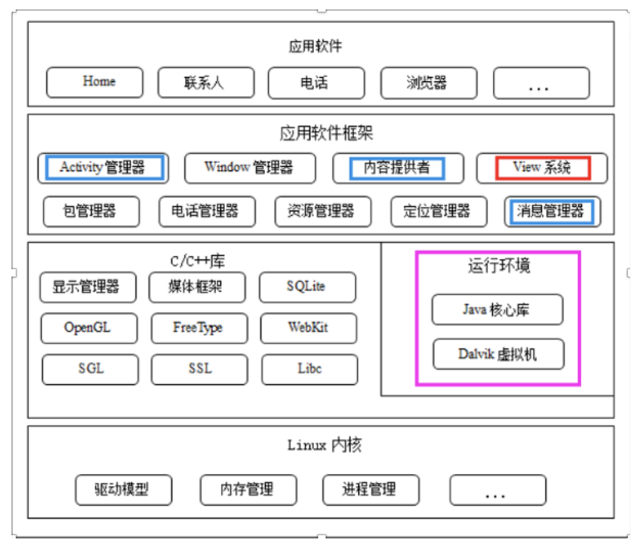

# 0102. 鸿蒙2：谷歌的生态系统

今天，我们熟悉的很多所谓的「安卓手机操作系统」，比如小米的 MIUI、魅族的 Flyme、一加的氢 OS、OPPO 的 ColorOS、锤子的 Smartisan OS，最初都是在安卓开源项目（AOSP）的基础上根据各家自己的风格设计的一套用户界面，其实并不能算操作系统。

## 2.1 鸿蒙是用户界面还是操作系统？

什么是用户界面呢？

也就是那些零件应该如何显示、弹出效果怎么保证流畅、翻页或者下滑的时候都显示什么工具、什么按钮等等工作，就是用户界面的范畴。

首先是 MIUI，从名字上就带了用户界面这个关键词。UI，就是 user interface（用户界面）。而有些开发比较晚的系统，可能觉得叫 UI 不够高级，于是纷纷给自己加上了 OS 的后缀，也就是 Operating System（操作系统）。这样看上去好像更加底层、更加凸显自身研发实力，不过所有这些品牌也在宣传中毫不掩饰自己实则是 UI 却号称 OS 的现状。

再有就是华为此前的 EMUI 系统，它反而和 MIUI 同样的成熟，只称自己是 UI 而不是 OS，也就是只称自己是用户界面而不是操作系统。

在 2021 年 6 月份，华为更新了鸿蒙系统，叫作 HarmonyOS。尽管带了 OS 的后缀，但严格的说，它也依然和 MIUI、Flyme 等等是一类，更是一个用户界面，而不是一个操作系统。

为了帮助你更好的理解什么才是安卓操作系统，我在这里放了一张图，这张图非常重要，后续的系列内容里还会多次出现。

在这张图里你可以看到，除了顶部的应用软件部分，其他的合在一起，可以算是一个完整的安卓操作系统。比如，谷歌自家的手机 NEXUS 系列用的就是这套操作系统，它最重要的部分是 Linux 内核。当然，Linux 内核也不是由谷歌开发的，而且一个更具有传奇色彩的开源项目。这部分内容我们曾经在《科技参考》第 188 期说过，就不再重复了。

那么说了半天，用户界面在这个结构图的什么位置呢？就是第二个模块里最右侧有个 View 系统，我用红框标出来了。各家品牌为了凸显自己的风格，工作都花在这里了。

## 2.2 谷歌生态链

在这个操作系统框图中，最关键的代码很多都是开源的，也就是来自于这期参考开头所说的安卓开源项目（AOSP）。而谷歌给手机做的完整的操作系统，除了安卓开源项目这一部分之外，还包含了一部分和钱相关的模块，被称为 GMS，全名是「谷歌移动服务」。这个模块的有和无，是区分一个手机是不是属于谷歌生态链的标志。

光听名字「移动服务」，听不出什么含义，但实际上，GMS 可以理解为，「让我加入谷歌生态系统大家庭」模块。

我们可以先来看看这个模块里有过哪些服务。我把曾经出现在 GMS 里的服务用一张图列了出来，这张图可能是《科技参考》有史以来最长的图。当然，里面有一些服务今天已经不再用了，还有很多新加入的没在这里。没关系，你只要知道有多少功能融合在 GMS 里就可以了。它包含了谷歌的地图导航、钱包、眼镜、TV、视频播放、搜索、翻译、智能电视、相册、邮件、智能穿戴、浏览器、云服务、输入法、远程桌面等等，全都是谷歌品牌的。

但你说，这不就是各种 App 大合集嘛，怎么就成了谷歌生态大家庭了？这些功能性软件我不需要啊，我就算需要，也可以去找一些非谷歌系的 App 代替，毕竟同样的功能，可能其他公司做的更好嘛。

同样的功能用谁家的 App 确实无所谓，但 GMS 里还包含了一个对手机生态系统来说极其重要的通知功能 —— 通知系统 + 账号系统 + 软件认证系统 + 付费与分成系统。

## 2.3 谷歌的通知系统与国产安卓手机

我们先说通知系统 ——

在国内的安卓手机生态环境里，我们马上能意识到的是，通知系统和广告密切相关，而广告又和钱直接相关，所以通知系统当然是生态系统的重要一环。这么理解虽然不错但并不完全，因为谷歌的大家庭里的手机和国内安卓手机之间的差别，更像 iPhone 和国内的安卓的差异。有没有谷歌的这个通知系统，就会导致手机耗电与否、内存是否追求大容量等等方面的差异。

这是什么意思呢？

如果你既用过 iPhone，也用过国产的安卓手机，即便不是专业人士，也能感受到两者的差异。举个例子：

微信来消息了，安卓手机即便是息屏状态，微信里的消息也在不断更新着，你解锁手机、一开微信，所有群里的新消息都等着你看呢。而 iPhone 就不一样了。iPhone 接到了一个微信通知，但是请注意，并不是消息的具体内容，而只是一个通知而已，具体是什么内容请解锁 iPhone。然后你就发现，iPhone 在刚解锁的几秒钟内，微信聊天记录的内容还是几个小时前的，几秒后，微信聊天列表里的内容才开始更新。其实不止是微信，iPhone 最初收到的都只是，「主人，您收到一条新消息，具体是什么消息，请您打开慢慢看」这样一条通知。

你说，干嘛要多一道程序呢？直接把消息的具体内容在息屏的时候更新到软件里多好啊？

是的，这样貌似方便一些，但你的手机里可不止装了一个微信，它还有 QQ、地图导航、天气、得到、浏览器、抖音、淘宝、钉钉、Office、阅读器、王者荣耀、笔记软件等等。它们也都要求和微信同等待遇，在手机息屏时也能正常在后台工作，于是你的手机即便在息屏状态下，电量也会因为 180 个软件都处于激活状态，电池嗖嗖嗖的就被耗尽了。

除了这个因素外，每个软件为了及时收到并且处理各种任务，于是就要占据手机内存的一定空间。我就看过自己微信内存的占用，在安卓手机的「进程管理」里，你也可以查查。可能因为我的微信群比较多的缘故，仅仅一个微信就占用了 900MB + 的内存，我手机还是小米 11，8GB 内存，算大的了，要是其他 4GB 内存的手机，那简直就不够用了。

你看，这就是程序长期驻留在内存的后果。而且，哪怕我们执行了安卓手机里常见的清理内存的操作，那些 App 其实也依然在内存中，那个清理内存的功能其实就是一个心理安慰的样子货。不信你清理一下，然后再从进程管理中看看它是不是消失了，其实占用的空间没怎么变化。

于是，在非谷歌大家庭的通知系统里，一款 App 要争取存活下来，就要用尽浑身解数，都争着成为开机启动的项目，然后为了防止自己被其他程序从内存中挤掉，就不停的自启动。当然，除了互杀，还有互捧的策略，往往同一个公司开发的不同 App 会设置交叉唤醒，启动了其中 1 个，它会负责唤醒自己的兄弟姐妹 App。

作为一个开发者，想在这个生态环境里独善其身，说我就是要从用户利益的角度出发，不争开机启动、不半小时来一次自启动、不侵占用户的手机资源，那他的 App 就会死的很惨。在中老年人的手机上就出现了这种情况，下拉栏里的通知多达几十上百个，也是在这种生态下演化出的竞争动作。

于是，在没有加入谷歌大家庭的生态圈中，开发者也只能采用最刷更底的底线的方式获取流量和下载量。开发者打成了一锅粥，直接的受害者就是手机厂商。你如果买过网上那种五六百块钱、号称性能主流的超级性价比安卓机就知道，那种完全没有经验的研发者，只是把一些不错的配制组装在一起，而只使用了谷歌的原生系统，但你把国产 App 往机器里一装，就再也不得安宁了，几个小时电量就耗光了，你如何清理内存都没用。

这是国产安卓手机没有谷歌「通知系统」的情况，如果添加了谷歌的「通知系统」，加入了谷歌的生态大家庭，那就和 iPhone 差不多，这些情况都避免了。

所以，今天中国比较大的手机品牌都有一套完善的攻防策略，防止系统资源被各种 App 快速吃光，其中一个策略就是尽可能的加大内存容量。

我现在问个问题，iPhone12 pro 的内存有多大？有人说，512GB、256GB。不对，那其实是存储空间，而不是内存，内存是和 CPU 直接沟通的那个空间。其实很多人都是说不上来的，因为这个参数对于有通知机制的手机来说，重要性并不那么夸张，它真实的内存是 4GB。其实，哪怕是 iPhone8 的 2GB 或者 iPhoneX 的 3GB，今天运行大部分 App 也照样流畅。为什么？因为在有健康的通知系统的手机中，所有 App 并不需要驻留在内存里。通知系统在这方面起到了很大作用。

而当我们再关注安卓手机的时候，12GB、16GB 这样夸张到比台式机电脑还要大的内存配置都已经出现了，但还是会比 iPhoneX 卡。即便 16GB 的内存容量，如果不做特地的保护和优化，也照样不禁用。

受限于篇幅，安卓手机在谷歌的生态系统和国产安卓手机的状况，我们放在明天继续介绍。